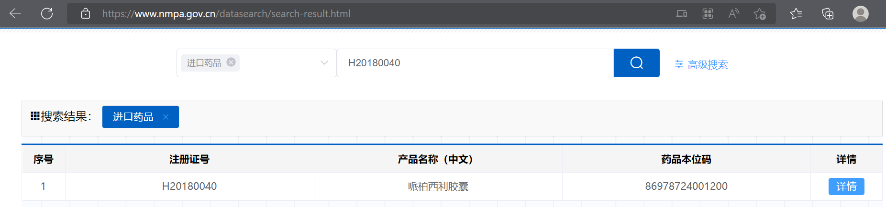
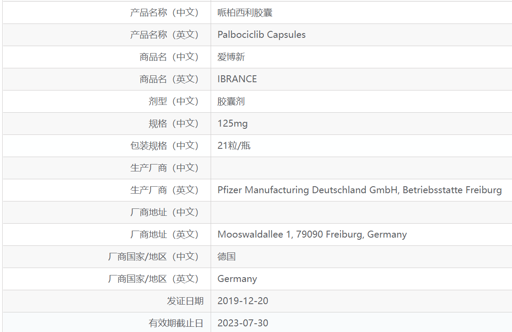

# 调查资料 @托|2022-8-2

医生资料
- 应红艳，女，副主任医师，副教授，1998年毕业于中国协和医科大学医学系，获博士学位，北京协和医院肿瘤内科。1998年-2002年在北京协和医院内科工作，有扎实的内科基础。2002年后在肿瘤内科工作。2005年曾赴美哥伦比亚长老会医院血液肿瘤科学习进修。2012-2013在澳门工作。从事包括乳腺癌、神经内分泌肿瘤、肺癌、胃癌，结直肠癌等各种肿瘤的综合治疗（化疗、靶向治疗和生物治疗理。对乳腺癌的内分泌治疗，化疗和靶向治疗知识和进展掌握全面。
- 专业擅长：乳腺癌、神经内分泌肿瘤，消化道肿瘤的综合治疗(肿瘤内科：化疗、靶向治疗和生物治疗)
---

药品资料
- 药品名：靶向抗癌药Ibrance（爱博新®，通用名：palbociclib，哌柏西利）
- 【批准文号】	注册证号H20180040
- 适应症：本品适用于激素受体（HR）阳性、人表皮生长因子受体2（HER2）阴性的局部晚期或转移性乳腺癌，应与芳香化酶抑制剂联合使用作为绝经后女性患者的初始内分泌治疗。
- 其他细节信息（见附录）
---
药监局查询结果：
- https://www.nmpa.gov.cn/datasearch/search-result.html

- https://www.nmpa.gov.cn/datasearch/search-info.html?nmpa=aWQ9Mzk3NCZpdGVtSWQ9ZmY4MDgwODE3YzgzMTJjNDAxN2M5YzU5MjI0ZTA0NWQ=

---
以往活动：

招募 软组织肉瘤 患者
尊敬的患者及家属朋友：
晚期软组织肉瘤治疗过去以化疗为主。近年来，国际上相继开展的多项研究，证实了分子靶向药物对本病的疗效。经国家食品药品监督管理局批准，北京协和医院肿瘤内科正在开展一项小分子靶向药物用于标准一线化疗后进展的晚期软组织肉瘤的全国多中心临床研究。肿瘤包括滑膜肉瘤，平滑肌肉瘤、腺泡状软组织肉瘤、未分化多形性肉瘤/恶性纤维组织细胞瘤、脂肪肉瘤、纤维肉瘤、透明细胞肉瘤和上皮样肉瘤。该药物为国家1.1类化学新药，申办方免费提供研究用药物并承担与研究相关的检查费用。

参加本研究的基本条件：

- 确诊为晚期软组织肉瘤患者，具有可测量病灶；

- 经标准一线化疗后进展的患者；

- 年龄≥18岁，身体基础状况较好，能坚持按期来院复查；

如果您至少符合上述条件，并且愿意参加本次临床研究，请来北京协和医院肿瘤内科

---
附录：
- 用法用量：应由具抗癌药物使用经验的医生开始并监督本品治疗。 推荐剂量 哌柏西利的推荐剂量为125mg，每天一次，连续服用21天，之后停药7天（3/1给药方案），28天为一个治疗周期。治疗应当持续进行，除非患者不再有临床获益或出现不可接受的毒性。 当与来曲唑联用时，来曲唑的推荐剂量为2.5mg，口服，每天一次，在整个28天治疗周期连续服药。具体请参见来曲唑批准的说明书。 给药方法 口服。应与食物同服，最好随餐服药以确保哌柏西利暴露量一致（见[药代动力学]）。哌柏西利不得与葡萄柚或葡萄柚汁同服（见[药物相互作用]）。 哌柏西利胶囊应整粒吞服（吞服前不得咀嚼、压碎或打开胶囊）。如果胶囊出现破损、裂纹或其他不完整的情况，则不得服用。 应鼓励患者在每天大约相同的时间服药。如果患者呕吐或者漏服，当天不得补服。应照常进行下次服药。 剂量调整 建议根据个体安全性和耐受性调整哌柏西利的剂量。 出现某些不良反应时可能需要暂时中断/延迟给药和/或减低剂量，或永久停药来进行控制，请参照表1、2和3中提供的方案进行剂量调整（见[注意事项]和[不良反应]）。 在开始哌柏西利治疗前、每个治疗周期开始时、前2个治疗周期的第15天以及有临床指征时应监测全血细胞计数。 对于前6个治疗周期内发生最高严重程度为1或2级中性粒细胞减少症的患者，其后续周期的全血细胞计数监测时间应为每3个月一次、各周期开始之前以及有临床指征时。 建议在中性粒细胞绝对计数（AbsoluteNeutrophilCount,ANC）≥1,000/mm3且血小板计数≥50,000/mm3时接受哌柏西利。 特殊人群 老年人 ≥65岁的患者无需调整哌柏西利的剂量（见[药代动力学]）。 儿科人群 尚未确定哌柏西利在≤18岁儿童和青少年患者中的安全性和疗效。没有数据可用。 肝损伤 轻度或中度肝损伤患者（Child-PughA级和B级）无需调整哌柏西利的剂量。重度肝损伤（Child-PughC级）患者的推荐剂量为75mg，每天一次，采用3/1给药方案（见[注意事项]和[药代动力学]）。 肾损伤 轻度、中度或重度肾损伤患者（肌酐清除率[CreatinineClearance,CrCl]≥15 mL/min）无需调整哌柏西利的剂量。需要血液透析患者的数据不充分，无法对该人群提供任何剂量调整建议（见[注意事项]和[药代动力学]）。 与CYP3A强效抑制剂合用时的剂量调整 避免伴随使用CYP3A强效抑制剂，考虑替换为没有或只有微弱CYP3A抑制作用的其他伴随用药。如果患者必须合用CYP3A强效抑制剂，则将哌柏西利的剂量减少至75mg，每天一次。如果停用强效抑制剂，则将哌柏西利的剂量增加至开始使用CYP3A强效抑制剂之前的剂量（在抑制剂的3至5个半衰期后）[参见[药物相互作用]和[药代动力学]]
- 作用机制和获批情况：brance是全球上市的首个CDK4/6抑制剂，于2015年2月首次获批上市，截止目前已获全球90多个国家批准用于HR+/HER2-乳腺癌的一线、二线治疗。2019年4月，Ibrance获美国FDA批准，成为全球首个也是唯一一个联合芳香酶抑制剂一线治疗HR+/HER2-转移性乳腺癌男性患者CDK4/6抑制剂。在美国，Ibrance用于治疗HR+/HER2-晚期或转移性乳腺癌成人患者：（1）联合一种芳香酶抑制剂作为初始内分泌疗法，用于绝经后女性或男性；（2）联合氟维司群用于接受内分泌疗法后病情进展的患者。（出处：Real-World Evidence Supports Effectiveness of First-line IBRANCE® (palbociclib) Combination Therapy in HR+, HER2- Metastatic Breast Cancer）
- 不良反应：本说明书描述了在临床试验中观察到的判断为可能由哌柏西利引起的不良反应及其近似的发生率。由于每项临床试验的条件各不相同，在一个临床试验中观察到的不良反应的发生率不能与另一个临床试验观察到的不良反应发生率直接比较，也可能不能反映临床实践中的实际发生率。安全性特征概要：哌柏西利的总体安全性特征评估来自在HR阳性、HER2阴性晚期或转移性乳腺癌随机研究中接受哌柏西利与内分泌疗法联合治疗（527例与来曲唑联用和345例与氟维司群联用）的872例患者的合并数据[包括研究PALOMA-1（A5481003），研究PALOMA-2（A5481008），研究PALOMA-3（A5481023）]。临床研究中，接受哌柏西利治疗的患者报告的最常见（≥20%）的任何级别的不良反应为中性粒细胞减少症、感染、白细胞减少症、疲乏、恶心、口腔炎、贫血、脱发和腹泻。哌柏西利的最常见（≥2%）的≥3级不良反应为中性粒细胞减少症、白细胞减少症、贫血、疲乏和感染。在研究PALOMA-2中评估了哌柏西利（125 mg/天）联合来曲唑（2.5 mg/天）治疗对照安慰剂联合来曲唑治疗的安全性。哌柏西利联合来曲唑的中位治疗持续时间为19.8个月，而安慰剂联合来曲唑的中位治疗持续时间为13.8个月。在接受哌柏西利联合来曲唑治疗的患者中，有36%的患者因任何级别的不良反应而减量。43/444（9.7%）例接受哌柏西利联合来曲唑治疗的患者以及13/222（5.9%）例接受安慰剂联合来曲唑治疗的患者发生了与不良反应相关的永久停药。导致接受哌柏西利胶囊联合来曲唑治疗的患者永久停药的不良反应包括中性粒细胞减少症（1.1%）和丙氨酸转氨酶升高（0.7%）。不良反应列表：按系统器官分类和发生频率列出不良反应。发生频率定义为：十分常见（≥1/10）、常见（≥1/100-<1/10）和偶见（≥1/1000-<1/100）。下表报告了3项随机研究[研究PALOMA-1（A5481003），研究PALOMA-2（A5481008），研究PALOMA-3（A5481023）]的合并数据集中的不良反应。合并数据集中哌柏西利治疗的中位持续时间为12.7个月。
- 注意事项：绝经前/围绝经期女性：鉴于芳香化酶抑制剂的作用机制，绝经前/围绝经期女性接受哌柏西利与芳香化酶抑制剂联合治疗时，必须进行卵巢切除或使用促黄体生成激素释放激素（Luteinizing Hormone Releasing Hormone，LHRH）激动剂抑制卵巢功能。哌柏西利胶囊联合氟维司群用于绝经前/围绝经期女性的研究中，仅与LHRH激动剂联合用药。危重内脏疾病（转移）：尚未在危重的有内脏疾病（转移）患者中研究哌柏西利的疗效和安全性。血液学毒性：中性粒细胞减少症是临床研究中最常报告的不良反应，临床研究中大约有2%的接受哌柏西利治疗的患者曾报告过发热性中性粒细胞减少症，并报告了1例中性粒细胞减少性败血症引起的死亡。应在哌柏西利治疗开始前、每个周期开始时、前2个周期的第15天以及出现临床指征时监测全血细胞计数。对于出现3或4级中性粒细胞减少症的患者，建议中断给药、减少剂量或延迟开始治疗周期，并进行密切监测。医生应告知患者立即报告任何发热事件。感染：因为哌柏西利具有骨髓抑制特性，其可使患者易于出现感染。多项随机研究报道了哌柏西利组患者的感染率高于各自的对照组患者。分别有4.5%和0.7%的接受哌柏西利任何联用方案治疗的患者发生了3级和4级感染。应监测患者的感染体征和症状并且适当时应给予治疗。患者在出现任何骨髓抑制或感染体征或症状时立即报告，例如发热、寒战、头晕、气短、无力或出血和/或瘀伤倾向加重。肝损伤：中度或重度肝损伤患者应慎用哌柏西利，并密切监测毒性体征。肾损伤：中度或重度肾损伤患者应慎用哌柏西利，并密切监测毒性体征。与CYP3A4抑制剂或诱导剂联合治疗：强效CYP3A4抑制剂可导致毒性增加。柏西利治疗期间应避免与强效CYP3A抑制剂合用。仅在认真评估潜在获益和风险后才可考虑同时使用。如不能避免与强效CYP3A抑制剂同时使用，应将哌柏西利的剂量降至75 mg每天1次。停止使用强效抑制剂时，应将哌柏西利的剂量（抑制剂的3 - 5个半衰期后）增加至开始使用强效CYP3A抑制剂前的剂量。与CYP3A诱导剂同时使用可导致哌柏西利的暴露量降低，所以有缺乏疗效的风险。因此，应避免哌柏西利与强效CYP3A4诱导剂合用。哌柏西利与中效CYP3A诱导剂同时使用时无需调整剂量。有生育能力的女性或其配偶：有生育能力的女性或其男性配偶在使用哌柏西利治疗期间必须使用一种高效的避孕方法。乳糖：哌柏西利含乳糖。存在半乳糖不耐症、Lapp乳糖酶缺乏症或葡萄糖-半乳糖吸收不良症等罕见遗传疾病的患者不得服用哌柏西利。对驾驶和操作机器能力的影响：哌柏西利对驾驶和操作机器能力的影响很小。但是，哌柏西利可能引起疲乏，患者在驾驶或操作机器时应谨慎。
- 历史消息：辉瑞（Pfizer）宣布，发表于同行评议期刊的真实世界证据（RWE）证明：在HR+/HER2-转移性乳腺癌（mBC）女性患者中，与来曲唑（letrozole）相比，靶向抗癌药Ibrance（爱博新®，通用名：palbociclib，哌柏西利）联合来曲唑一线治疗改善了真实世界无进展生存期（rwPFS）和总生存期（OS）。这些发现是首次在常规临床实践中对一种CDK4/6抑制剂的生存结果进行综合比较疗效分析，数据已发表于《Breast Cancer Research》