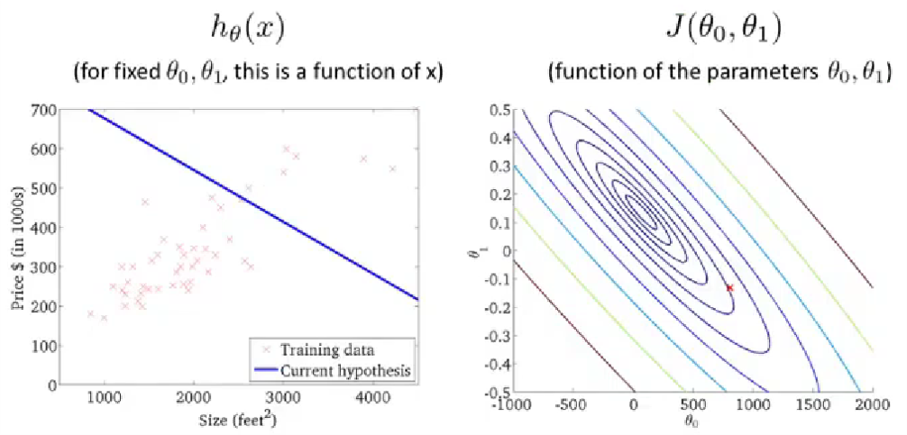

# 《机器学习&深度学习笔记》

机器学习的概述
1. 一些知识点：
    - 学习目标：算法中机器学习解决的主要问题类型，主要术语，了解不同的算法，以及每种算法的适用场景，以及应用学习算法时的实际建议。网络、自动化技术、大数据和算力的发展是让机器学习如此火热的一个原因。
    - SOTA-State of the art，指代最先进的模型。
    - Octave。它是一个与MATLAB语法兼容的科学计算编程语言。使用Ovtave可以快速的建立机器学习原型，在这个算法可以工作后，再迁移到其他编译环境中。
1. 机器学习应用实例：
    - 数据库挖掘：网页点击数据，医疗记录数据，计算生物学，工程学
    - 无法手动编写的程序应用：自动驾驶直升机，手写识别，自然语言处理（NLP-Natural language processing），计算机视觉（CV-Computer vision）等应用
    - 私人定制项目：亚马逊，视频推荐系统（自我学习）
    - 理解学习人类行为（大脑，真正的AI）
1. 机器学习定义
    - 在没有明确设置的情况下，使计算机具有学习能力的研究领域（Athrur Samuel）
    - 计算机程序从经验E中学习， 解决某一任务T，进行某一性能度量P（Probability），通过P测定在T上的表现因经验E而提高（Tom Mitchell）
1. 机器学习算法分类：
    - 监督学习（Supervised learning）：我们教计算机做某件事
    - 非监督学习（Unsupervised learning）：我们让计算机自己学习
    - 其他：强化学习，推荐系统等
1. 监督学习（Supervised learning）
    - 定义：我们给算法一个数据集，其中包含了正确答案，算法的目的就是给出更多的正确答案（数据集有标签）
    - 回归问题（Regression），预测一个连续值的输出
    - 分类问题（Classification），预测一个离散值的输出
1. 非监督学习（Unsupervised learning）
    - 定义：数据集都有相同的标签或没有标签，从数据集中找到某种结构、类型或簇
    - 聚类问题（Clustering）：我们没有提前告诉算法数据的类型或属性
    - 奇异值分解函数。SVD（Singular value decomposition）
1. 非监督学习的应用：
    - 通过基因组来识别不同类型的人群
    - 数据中心用来组织大型计算机集群，找到哪些机器趋向于协同工作，然后把这些机器放在一起，可以让数据中心更高效的工作
    - 社交网络分析。自动识别同属于一个圈子的朋友，判断哪些人可能互相认识
    - 市场细分。自动找出不同的市场分割，并自动将客户分到不同的细分市场中，从而自动高效的在不同的细分市场中进行销售。我们有全部的客户和销售数据，但预先不知道有哪些细分市场
    - 天文数据分析。帮助分析和构建星系形成的理论

---

模型描述（Model representation）
1. 定义：训练集，测试集，样本数量 $m$，输入特征 $x$，输出变量 $y$（预测目标变量），一个训练样本 $(x,y)$，第 $i$ 个索引对应的训练样本 $(x^{(i)},y^{(i)})$
    - 假设函数：模型拟合后的函数 $h(θ)$
    - 参数：拟合后函数的参数 $θ$
    - 代价函数：在不同的 $x$ 下，假设函数与真实值之间的误差平方和的 $\frac{1}{2m}$，
    - $J(θ)=\frac{1}{2m} \sum_ {i=1} ^{m} (h_θ(x^{(i)})-y^{(i)})^2$
    - 目标函数：在不同的参数θ下，取得最小的代价函数 $min J(θ)$
1. 假设函数（Hypothesis function）。比如当解决一个实际的问题时，先考虑简单的线性函数（如：Linear regression），根据实际的效果再考虑非线性函数。格式：$h_θ(x) = θ_0 + θ_1·x$（$θ_0，θ_1$为模型参数）
1. 代价函数（Cost function）。用J来表示，尽量让预测值和实际值的误差平方和最小（目标函数）。
    - $min_{θ_0,θ_1} J(θ_0,θ_1) = min_{θ_0,θ_1}\frac{1}{2m}(\sum_{i=1}^{m}(\hat{y^{(i)}}-y^{(i)}))^2=min_{θ_0,θ_1}\frac{1}{2m}(\sum_{i=1}^{m}(h_θ(x^{(i)})-y^{(i)}))^2$。
    - cost function也被称作squared error function（平方误差代价函数），是解决回归问题最常用的手段。
    - 代价函数曲线（一维）：比如假设只有一个参数 $θ_1$，通过 $J(θ_1)$ 与 $θ_1$ 的关系曲线，可以看出随着θ的变化，代价函数 $(Jθ_1)$的变化趋势曲线。那么学习算法的优化目标，就是通过选择θ1的值，来获得最小的 $J(θ_1)$，这就是该模型的目标函数
    - 代价函数曲线（二维）：当同时分析 $J(θ_0,θ_1)$和$θ_0，θ_1$之间的关系时，会得到一个三维曲面，找到最低点来使代价函数最小。三维曲线可以转化为二维等高线图（contour plot）来展示，等高线图的中心点就是目标值点。
    
    - 我们真正想要的一个高效的算法，是能够可以自动寻找代价函数J取得最小值时的参数 $θ$。尤其是那些很难可视化的多参数，多维度的算法。
1. 梯度下降（Gradient descent）
    - 梯度下降法可将代价函数 $J(θ)$最小化。被广泛用于机器学习的众多领域和众多函数中。
    - 梯度下降的思路：对于$J(θ_0,θ_1)$，我们给定$θ_0$和$θ_1$的初始值，初始值其实不关键，通常选择将$θ_0$和$θ_1$都设为$0$，然后不停的一点点改变$θ_0$和$θ_1$，来使$J(θ_0,θ_1)$变小，直到我们找到$J(θ)$的最小值，或局部最小值。（联想人站在三维曲面上要下山的例子，当我们选择一个初始点要准备下山，我们会去看这个点的周围，哪个方向下山最快，然后迈出一步到达下一个点。到达下一个点后，再去看周围，再决定下山最快的方向，然后迈出一步。不断重复这个过程，直至到达最低的点）
    
1. 梯度下降算法公式：
    - （赋值运算符 := 例如a:=b，表示a取b的值的含义。整个过程不断重复直至收敛）
    - 梯度下降算法公式： 
    - Repeat {$θ_j:=θ_j-α\frac{∂}{∂θ_j}J(θ_0,θ_1)$}($for j=0,j=1$)
    - $temp0 := θ_0-α\frac{∂}{∂θ_0}J(θ_0,θ_1)$
    - $temp1 := θ_1-α\frac{∂}{∂θ_0}J(θ_0,θ_1)$
    - $θ_0 := temp0$
    - $θ_1 := temp1$
    - 计算时，$θ_0和θ_1$需要同时更新
    - $α$ 被称作学习率（Learning rate）。它控制着我们以多大的幅度更新参数 $θ_j$。学习率决定了梯度下降时，我们迈出多大的步子。当α很大，我们就用大步子下山；如果 $α$ 很小，我们就用小碎步下山。学习率很小，梯度下降的速度会很慢；学习率很大，梯度下降可能会越过最低点，甚至可能会越过最低点，甚至可能无法收敛或者发散
    
    - $J'(θ_j)$ - 表示代价函数 $J(θ_0，θ_1)$ 对 $θ_j$ 求导的导数项
1. 导数项（Derivative term）。$J'(θ_1)$ - 偏导数，用来求梯度下降的方向。当达到局部最低点时，导数项为0，迭代停止。而随着每次迭代，导数项绝对值越来越小，导致每次移动的幅度也越来越小，最终收敛到局部极小值（如果初始参数已经在局部最优点，那么梯度下降法更新其实什么都没有做，迭代并不会改变参数的值。数学知识：求最优解时，让目标函数一阶偏导为0。而要求这个偏导为0的方程，需要通过二阶偏导来继续求连续函数才能求解）
1. 线性回归的梯度下降（Gradient descent for linear regression）将梯度下降和代价函数结合，得到线性回归的算法。（导数项的求导：涉及到隐函数求导，求和公式里面的h(x)是包含在(h(x)-y)^2内的隐函数，也就是复合函数，复合函数求导，先对中间变量求导，在对自变量求导。偏导数求导，需要把除自身以外的变量当做常数来对待。求导过程涉及到多元微分知识）导数项求导后，分别得到θ0和θ1对应的偏微分导数。（梯度下降算法容易陷入到局部最优的问题）
    - Linear regression:
        - $h_θ(x)=θ_0+θ_1x$
        - $J(θ)=\frac{1}{2m}\sum_{i=1}^{m}(h_θ(x^{(i)})-y^{(i)})^2$
    - Gradient descent:
        - $θ_j:=θ_j-α\frac{∂}{∂θ_j}J(θ_0,θ_1)$
    - Objective function:
        - $min_{θ_0,θ_1}J(θ_0,θ_1)$
    - Partial derivative:
        - $\frac{∂}{∂θ_j}J(θ_0,θ_1)
        = \frac{∂}{∂θ_j}[\frac{1}{2m}\sum_{i=1}^{m}(h_θ(x^{(i)})-y^{(i)})^2]
        = \frac{∂}{∂θ_j}[\frac{1}{2m}\sum_{i=1}^{m}(θ_0+θ_1x^{(i)}-y^{(i)})^2]
        $
        - $\frac{∂}{∂θ_0}J(θ_0,θ_1)=\frac{1}{m}\sum_{i=1}^{m}(h_θ(x^{(i)})-y^{(i)}),(j=0)$
        - $\frac{∂}{∂θ_1}J(θ_0,θ_1)=\frac{1}{m}\sum_{i=1}^{m}(h_θ(x^{(i)})-y^{(i)})·x^{(i)},(j=1)$
    - Repeat until convergence {···}
        - $θ_0:=θ_0-α\frac{1}{m}\sum_{i=1}^{m}(h_θ(x^{(i)})-y^{(i)})$
        - $θ_1:=θ_1-α\frac{1}{m}\sum_{i=1}^{m}(h_θ(x^{(i)})-y^{(i)})·x^{(i)}$
1. 凸函数（Convex function）。又称弓形函数（Bow shaped function）如线性回归代价函数的三维曲面形状。没有局部最优解（Local optimum），只有一个全局最优（Global optimum）
    
1. 批量梯度下降（Batch gradient descent）。意味着每次梯度下降，我们都遍历了整个训练集样本，在计算偏导时计算总和。在每一个单独的梯度下降，我们计算m个训练样本的总和。（所以批量梯度下降，指的就是分析整个训练集。对于其他非批量的梯度下降方法，每一步关注的就不是整个训练集，而是其中的小子集。）
    - 求解代价函数J的最小值，可以不需要使用像多步骤的梯度下降的迭代算法（Iterative algorithm），比如正规方程组方法（Normal equations methods）。相比于这种方法，梯度下降法适用于更大的数据集

---
矩阵和向量（Matrix and vectors）
1. 线性代数（Linear algebra）
1. 矩阵（Matrix）：由数字组成的矩形阵列，也称二维数组。矩阵的维数表示为：行数 * 列数。$A_{(ij)}$指代矩阵中的某个具体元素
1. 向量（Vector）：向量是只有一列的矩阵。这一列对应的元素数，称为向量的维度。通常用大写字母表示矩阵，小写字母来表示向量
1. 标量乘法（Scalar multiplication）
1. 矩阵向量乘法（Matrix-vector multiplication）
    - 矩阵乘以向量：$(m*n)$ 乘以 $(n* 1)$向量，得到$(m* 1)$向量
    - 应用实例小技巧☆：一系列输入x [2104，1416，1534，852]，假设函数$h(x) = -40+0.25x$，用矩阵乘法的思维来快速计算。转化为矩阵（[1,2104]; [1,1416]; [1,1534]; [1,852]）与向量[-40; 0.25]的乘法来计算。计算机在处理矩阵计算时的计算效率更高，如果不转化为矩阵，则需要通过for循环实现这类计算。
1. 矩阵矩阵乘法（Matrix-Matrix multiplication）
    - 矩阵$(m* n)$与$(n* s)$相乘，最后得到$(m*s)$矩阵。（口诀：中间相等取两头）- （top10的变成语言中都有经过高度优化过的矩阵库，可以帮助高效来做矩阵乘法，甚至可以多核并行计算来更高效的完成多个假设函数的预测结果）
    - 矩阵乘法不满足交换律，但服从结合律。$A×B≠B×A，A×(B×C) = (A×B)×C$
    - 单位矩阵（Special matrix）。记作$I(n*n)$，$n$表示矩阵的维度，$n * n$单位矩阵。单位矩阵的特性，对角线的数字都为1，其他位置都为0。对于任何的单位矩阵$I$，$A·I = I · A = A$
1. 特殊的矩阵计算
    - 矩阵逆运算（Matrix inverse）。$A·A^{(-1)} = A^{(-1)}·A = I，A$为方阵，只有方阵才有逆运算。
    - 方阵（Square matrix）- 矩阵的行数和列数相等
    - 奇异矩阵（Singular matrix）或退化矩阵（Degenerate matrix）：不存在逆矩阵的矩阵，比如都为0的矩阵，或不是方阵的矩阵
1. 矩阵转置运算（Matrix transpose）
    - 转置矩阵 $A → A^T$。相当于画了一条-45°的线，矩阵A以这条线为轴进行翻转，得到$A^T$（行列互换）
    - 标准定义：$A$为$(m * n)$矩阵，$B$为$A$的转置，$B=A^T$，则$B$为$(n*m)$矩阵，那么$B_{(ij)} = A_{(ji)}$
    

---
多元特征（Multiple features）
1. 特征向量（Feature vector）。$x^{(2)} = [124,125,34,2]$表示一个四维特征向量，$(2)$表示索引。$x^{(i)}_j$表示第$i$个训练样本中第$j$个特征量的值。
    - 对于一个多元线性回归问题（Multivariate linear regression），变量$x=[x_0; x_1; x_2; x_3...x_n]$, 特征$θ=[θ_0; θ_1; θ_2; θ_3...θ_n]$。假设函数$h_θ(x) = θ_1x_1 + θ_1x_1 + ... +θ_nx_n = θ^T·x$
1. 多元梯度下降法（Gradient descent for multiple variables）
    - 梯度下降的通俗理解：（迭代一轮后的参数$θ$） = （迭代前的参数$θ$） - 学习率*（代价函数$J(a,b,c...n)$对参数$θ$的偏导数）
1. 特征缩放（Feature scaling）
    - 让特征都在同一个量纲范围内，这样梯度下降法会更快地收敛（Converge）。特征缩放后，代价函数的等高线图就没有很严重的偏移情况，这样可以更容易的找到更直接更短的道路到达全局最小点，速度也会更快。
    - 特征缩放，是将特征的取值约束到$（-1,1）$的范围内，共同除以某一个值。
    - 归一化（Normalization）。所有的值都减去均值，再除以特征的范围（最大值减最小值），这样让特征值拥有为0的平均值。或者可以除以特征的标准差来计算（标准化）。
    - 特征缩放的意义：无论是采用什么方式，原理和取值都是非常近似的，只要将特征值转换为相近似的范围都是可以的。特征缩放并不需要太精确，只是为了让梯度下降能够运行的更快，迭代的次数更少而已。
1. 学习率（Learning rate）
    - 实际应用过程中一般会绘制梯度下降曲线，横坐标为迭代次数（No. of iterations），纵坐标为最小代价函数$（minJ(θ)）$。如果模型正常工作的话，每一步迭代之后J（θ）都应该下降。 从这个曲线可以看出经过多少次迭代后，梯度下降算法已达到收敛，不再继续下降。很难预先判断梯度下降算法，需要多少步迭代才能收敛，不同应用需要的收敛步骤差异很大
    - 自动收敛测试（Automatic convergence test）：比如设定一步迭代后代价函数的降低的量的阈值 $epsilon< 10^{(-3)}$，就判断函数已经收敛。但实际应用由于很难弄设定这个阈值，所以更多的还是通过绘制曲线来看变化趋势和幅度。
1. 学习率 $α$ 的选择
    - 如果代价函数 $J(θ)$ 没有随着迭代次数的增加而稳定降低，需要减小学习率 $α$。（学习率 $α$ 大，迭代快，但可能不收敛（增加或不规律跳动）；学习率 $α$ 小，迭代慢，迭代次数多，更容易收敛）。
    - 有相关证明表示，只要学习率 $α$ 足够小，代价函数 $J(θ)$ 都会逐渐降低。实际应用中，通常多尝试几组学习率的值，间隔几倍 $(α=0.001, 0.01, 0.1...$ 等，或者3倍 $α = 0.003, 0.03, 0.3...）$。对于大数据样本，加速收敛就是刚开始选择大学习率，然后随着迭代不断地减小学习率
1. 特征与多项式回归（Feature & polynomial regression）
    - 构造新特征。比如通过房屋的长、宽构造房屋的面积特诊，进而预测房屋价格和面积之间的关系（注：当构造的新特征量纲过大时，要记得特征缩放）
    - 构造新特诊，并自由选择和设计特征组合，从而能够用更复杂的函数来拟合数据
1. 正规方程（Normal equation）
    - 正规方程法在少数算法中适用（如：线性回归）；而在其他算法中不适用，比如分类或逻辑回归算法等，这种情况仍然需要用梯度下降法
    - 基于迭代算法的思维，梯度下降法（Gradient descent）可以帮助找到参数的最优值 $（θ-theta）$。而正规方程提供了一种求解θ的解析解法，可直接一次性的求解到最优值。正规方程解法。如二次函数，先求导（Take derivatives），将导数置 $0$ ，然后求得对应 $θ$（微积分calculus思路）。
1. 正规方程法公式：使代价函数最小化的求解公式 $θ = (X^{(T)}·X)^{(-1)}·X^{(T)}·y$。$θ$ 为$X$转置乘以$X$的逆，乘以$X$转置，乘以$y$。（此方法不需要做特征缩放）
    - 乘以转置的目的是为了确保它有逆矩阵，不然没法计算 
    - 矩阵的秩（Rank）：方程组中真正是干货的方程个数，就是这个方程组对应的秩。秩是列空间的维度，也是图像经过矩阵变化之后的空间维度
    - 满秩矩阵（Full rank）：矩阵的满秩包括行满秩和列满秩，既是行满秩又是列满秩的话一定是方阵。满秩方阵可逆，可逆矩阵一定是方阵。而且「秩」=「列秩」=「行秩」是恒成立的
1. （正规方程法和梯度下降法优劣对比）$m$-训练样本，$n$-特征数量。
    - 正规方程法：优：①不需要选择学习率②不需要迭代；劣①需要计算矩阵转置和逆（$n*n$的复杂度，计算量以$n^3$的数量级增长）②当$n$很大时，计算会非常慢
    - 梯度下降法：优：当$n$很大时也可以很好工作；劣：①需要选择学习率；②需要很多次迭代
    - 经验做法：$n>10000$时，可以倾向于梯度下降法
1. 正规方程的不可逆性（Normal equation & non-invertibility）
    - 不可逆的矩阵为：奇异矩阵（Singular）或退化矩阵（Degenerate）
    - 不可逆的原因：冗余特征（如：线性相关），特征太多（如$m < n$，解决办法-删除特征或正则化（Regularization））

---
代码操作-Octave
1. Octave开源，与matlab语法高度兼容。与之对应的是python numpy
2. 向量化（vectorized implementation），相比于for循环的运算速度会更快，会让代码运行的更高效

---
逻辑回归（logistic regression）和分类（classification）
1. 离散型变量的预测问题
    - 正例（positive class）：表示具有我们要寻找的东西，负例（negative class）：表示没有某样东西。（但正负并没有明确规定，也不重要）
    - 逻辑回归（logistic regression）算法是一种分类算法，输出结果在0~1之间
1. 假设表示（hypothesis representation）。logisitc function又叫sigmoid function（函数），g(z) = 1/(1+e^(-z))。逻辑回归模型的假设函数 hθ(x) = g(θT·x) = 1/(1+e^(-θT·x)。
    - 模型的解释（interpretation）：依赖假设来估计y=1的概率。
1. 决策边界（decison boundary）：
    - 使用sigmod函数的意义在于将（-∞，+∞）映射到了（0，1）上，映射后函数横轴小范围内变化灵敏，大范围内变化平缓。
    - 对于hθ(x) = g(θT·x) = 1/(1+e^(-θT·x)，求解过程相当于让θT·x≥0时，即hθ(x)>0.5的边界，按照sigmoid函数即hθ(x)=1的范围（>0.5就会被归为=1的类别中）。hθ(x)=0.5即为决策边界。决策边界是假设函数的一个属性，不受数据集的影响。
1. 非线性决策边界（non-linear decision boundaries)
    - 决策边界不是训练集的属性，而是假设本身及其参数的属性，只要给定了θ，非线性的决定边界就能够确定了。（训练集用来拟合θ，θ确定了决策边界）
    - 对于假设函数为更高阶多项式的情况，将计算得到更复杂的决策边界。logistic regression将用于寻找决策边界。
1. 代价函数/损失函数（cost function）。对于实际值是y，但是学习算法给出的预测值是H，那就需要让这个算法付出代价。
    - 非凸函数（non-convex function）。如果将线性回归方法的代价函数公式直接应用在逻辑回归中，J(θ)为非凸函数（因为sigmoid函数形式导致的）。但我们希望代价函数是一个凸函数(convex function)，即单弓形函数（bow-shaped funciton），对于凸函数使用梯度下降法，会收敛得到该函数的全局最小值。
    - logistic regression函数的代价函数，求导！Cost(hθ(x),y) = -log(hθ(x)), if y=1; Cost(hθ(x),y) = -log(1-hθ(x)), if y=0. （理解：当y=1时，如果hθ(x)=1，那么cost=0；如果h(θ)→0，cost→∞，也就意味着这种极端错误的情况，我们将会用很大的力度来惩罚这个算法，也就是说算法要为这个错误付出的代价。y=0的情况下同理）
1. 简化代价函数和梯度下降（simplified cost function and gradient descent）。逻辑回归的代价函数是从统计学中的极大似然法得来的，它是统计学中为不同的模型快速寻找参数的方法，同时它还有一个很好的性质，它是凸函数。因此这个代价函数成为了logistic回归模型最常用的代价函数。使用梯度下降法来求代价函数的最小值，进而拟合参数θ
    - 逻辑回归算法的梯度下降公式虽然看起来和线性回归一样，但假设的定义发生了改变（hθ(x)不一样了）。hθ(x) = θ^T·x，hθ(x) = 1/(1+e^(-θ^T·x))
    - 特征缩放同样可以应用于逻辑回归算法，让梯度下降的收敛速度更快。
    - 逻辑回归是很强大，有可能是世界上最广泛的一种分类算法。
1. 高级优化算法（advanced optimization algorithm）。
    - 共轭梯度法Conjugate gradiet，BFGS，L-BFGS。这类算法的优点：不需要手动选择学习率α，比梯度下降法的收敛速度更快；但缺点是更复杂。这类算法的内部包含一种叫做线搜索算法（line search algorithm）的方法，它可以自动尝试不同的学习速率α，并选择一个好的学习速率α，它甚至可以为每次迭代选择不同的学习速率，这样你就不需要自己选择。 
1. 多类别分类（multi-class classification）。用逻辑回归方法来解决多类别分类问题。一对多分类算法（one-vs.-all classificaiton，或者叫one-vs.-rest）。二元分类（binary classification）
    - 举例：一个3分类问题，训练生成3个二分类器。当一个新的x进来时，全部输入到3个分类器中，全部进行判别，选概率值（即hθ(x)）最高的那个分类器，即为这个x对应的类别 。通过这个过程就确定了x要选择的分类器，这个分类器对于x的可信度最高，效果最好。

---
过拟合（overfitting），代价函数（cost function），正则化（regularization）：
1. 欠拟合（underfitting）：算法没有很好的拟合训练集，具有高偏差（high bias）；过拟合（overfitting）：算法过度拟合训练集，具有高方差（high variance）。
1. 过拟合（overfitting）：通常会在变量过多的时候出现，这时训练出的假设能很好地拟合训练集，所以你的代价函数可能非常接近于0，但这样你可能会得到一个方程，它千方百计地拟合训练集，导致它无法泛化到新的样本中，无法预测新样本的结果

1. 泛化（generalize）：一个假设模型应用到新样本的能力。调试（debug）和诊断（diagnose）
1. 避免过拟合的方法：
    - 减少特征/变量的数量：
    - 手动选择保留哪些特征（删除特征可能会导致信息丢失）
    - 模型自动选择算法 - model selection algorithm
1. 正则化（regularization）
    - 保留所有的特征，但是减少量级或参数θ的大小。我们在函数中加入惩罚项（penalize），在代价函数中加入要惩罚的某些参数θ（有时会带一个很大的常数系数-惩罚项），那么这些参数就会很小，从而弱化这些参数对假设函数的影响。
    - 正则化的思想：如果我们的参数值θ较小，参数较小意味着假设模型会变得更简单。正则化之后的代价函数是在代价函数的后面，加上一个额外的正则化项，这个项的作用是来缩小每个参数θ的值。正则化的目标，是为了控制两个不同目标之间的取舍，第一个目标，与目标函数的第一项有关，让算法尽可能的去拟合训练数据集；第二个目标，我们要保持参数尽量地小，与正则化的目标有关。正则化项前面的系数λ，即正则化参数，作用是控制这两个目标之间的平衡。即更好地去拟合训练集的目标和将参数控制得更小的目标（减小不重要特征参与计算的权重），从而保持假设模型的相对简单，避免出现过拟合的情况。
1. 线性回归正则化
    - 梯度下降（gradient descent），正规方程（normal equation）法应用正则化后θ的求解方法
    - 逻辑回归正则化（regularized logistic regression）
1. 非线性假设（non-linear hypotheses）
    - 神经网络（neural network）。对于不确定的特征组合问题，遍历特征会使特征空间急剧膨胀。当特征个数n很大时，增加特征来建立非线性分类器并不是一个好的做法。神经网络在学习复杂的非线性假设上被证明是一种好得多的方法。
    - 图像识别问题举例：对于50x50像素点的图片，灰度值处理后会有2500个像素点，每个像素点代表图片的一个特征，所以这个图片的特征维度共有2500维。如果是RGB处理，那么将会产生7500个像素点（由红绿蓝三种颜色，不是灰色）
    - 神经网络算法表示（represent）。通常如果第一个假设函数为逻辑回归单元，那么则成为带有sigmoid或logistic激活函数（sigmoid（logistic）activation function）的人工神经元。激活函数是指代非线性函数g(z) = 1/(1+e^(-z))的另一个术语。 在神经网络的说法中，通常也会把参数θ成为权重（weight）。
    - 神经网络是一组神经元连接在一起的集合。输入层（input layer）包含了各种输入特征x，输出层（output layer）包含了假设的最终计算结果，隐藏层（hidden layer）包含了除去输入层和输出层外的其他所有层（可以有很多层）
    - 神经网络中，a^(j)_(i)表示了在j层第i个单元的激活项，激活项表示由一个具体的神经元计算并输出的值。神经网络被这些矩阵参数化，θ^(j)就是权重矩阵，它控制着第一层到第二层，或第二层到第三层的映射（θ下标对应关系，上标对应在神经网络的第几层）。
    - 神经网络计算假设输出的步骤。通过输入特征+权重矩阵，计算出隐藏单元的激活值（这些激活值都是神经元输入特征的加权线性组合），利用这些值来计算得到最终输出的假设函数h(x)
    - 神经网络计算向量化（vector）计算实现方法。前向传播（forward propagation）：从输入单元的激活项开始，然后进行前向传播给隐藏层，计算隐藏层的激活项，然后我们继续向前传播，并计算输出层的激活项。这样来依次计算激活项，从输入层到隐藏层再到输出层的过程叫前向传播。
    - 神经网络做的事就是：就像逻辑回归，但它不是使用原本的x1，x2...作为特征来训练逻辑回归，而是用计算得到的激活项a1，a2...作为新的特征，自己训练逻辑回归。从第一层到第二层，也对应着不同的参数θ（大写）（这里θ用大写，跟单一算法的参数小写θ区分开）根据参数的选择不同，有时可以学习到一些很有趣和复杂的特征，就可以得到一个很好的假设函数。神经网络利用隐藏层，计算更复杂的特征，并输入到最后的输出层，以及学习到更复杂的假设函数。（本质上有点类似于“循环嵌套自动调优”的逻辑回归组合）
    - 偏置单元（bias unit）。神经网络中单独添加的神经元项，偏置单元的参数θ为1，通常可设定为常数项。不一定非要添加在输入层，在隐藏层也可以添加。
1. 神经网络架构（neural network architecture）。即神经网络中不同神经元的连接方式。每一层都会基于上一层的计算结果，作为本层计算的新的特征，并结合复杂的输入层功能，在本层计算得出更复杂的特征，每一层重新训练出的特征都会更加复杂，从而最终得到非常有趣的非线性假设函数。
1. 神经网络如何训练复杂的非线性假设模型。如何解决异（XOR - Exclusive OR：两个值不相同，结果为1，相同为0）或和同或（XNOR - Exclusive Not OR：两个值相同，结果为1，不同为0）问题？通过不断选择每个神经元特征的权重和偏置，神经网络假设函数就可以实现逻辑上的与或非（先在中间层按照通常或与非的逻辑关系转化，然后再通过这个逻辑关系计算得到的结果，进一步实现XOR和XNOR的问题。即通过中间层转化来间接实现）。
1. 神经网络多元分类（multi-class classification）。神经网络解决多分类问题，本质上是（一对多法，one-vsersus-all）的拓展。比如四分类问题，最终通过神经网络形成4个独立的逻辑回归模型，分别对应了四个类别。

---
神经网络代价函数（cost function）
1. 一个训练算法，在给定训练集时，为神经网络拟合参数。神经网络的激活函数，K维对应K个训练模型，所以常规项的计算结果要进行K维求和。正则化项要进行三层求和累加（从左到右依次是“层-行-列”，层范围（1，L-1），行范围（1，Sl），列范围（1，Sl+1），加1的原因是因为输入层加了偏置项。最后三维度累加将正则化项求和）
2. ☆反向传播（backpropagation algorithm）。目的是为了让神经网络代价函数最小。在神经网络中的代价函数通过反向传播或前向传播的方式，来提高预测的准确率，然后在梯度下降的时候，为了找到合适的速度以及方式，需要优化偏导项，也就是求偏导项的最小值。
    - 反向传播过程理解：把前向传播向量化，这样可以计算出神经网络结构里的每一个神经元的激活值。接下来为了计算导数项，需要采用一种叫做反向传播（back propagation）的算法。反向传播算法从直观上说，就是对每个节点，计算这样一项，δ^(l)_j = "error" of node j in layer l，它代表了第l层的第j个结点的误差。每个节点会对应计算激活值a^(l)_j，而δ就是用来捕捉在这个神经节点的激活值的误差（比如输出层第4层第j个元素，δ^(4)_j = a^(4)_j - y_j）。写成向量化的形式用于计算，δ^(4) = a^(4) - y，向量的维数等于输出单元的数目。至此，我们算出了输出层的误差，接下来要计算网络中前面几层的误差项δ，通过激活向量以及偏导数的计算。计算只包含输出层和隐藏层，没有输入层的，因为输入层是训练集观测到的，不存在误差项。反向传播源于我们从输出层开始计算误差项（δ），然后我们返回到上一层来分别计算隐藏层的误差项（δ），然后我们再往前一步来计算。我们类似于把输出层的误差，反向传播给了上一层，然后再往上上一层传播，这就是反向传播的意思。 
    - 反向传播的理解。前向传播过程是输入层的输入单元（x,y）通过权重矩阵，得到第二层的输入值，即输入层通过权重矩阵得到的加权和z(2)，然后加权和应用到sigmoid激活函数中，得到对应激活值a(2)；然后继续向前传播，得到加权和z(3)，然后再继续应用到sigmoid激活函数中，得到a(3)；最后到达最后一层第四层，加权得到z(4)，应用到sigmoid函数中，得到a(4)，即整个网络的输出值。反向传播过程与前向传播过程相反，从输出层不断计算误差项，然后再逐步向上一层计算隐藏层的误差项。反向传播的计算一般不包含偏置单元，但这具体取决于你对反向传播的定义以及你实现算法的方式，也可以采用其他的计算方式来计算包含偏置单元的误差δ值，偏置单位的输出总是“+1”，并且他们一直都是这样，我们无法改变它，这些都取决于你对反向传播的实现方式。通常即使计算了偏置项的误差，也可以丢弃不用，因为它们最后并不会影响偏导数（代价函数的偏导数）的计算。
1. 参数矩阵展开（parameter vectors unrolling）。在神经网络算法中，参数的向量化是矩阵（与之前不同的是，逻辑回归的参数向量化后是一个向量）
1. 梯度检测（gradient checking）
    - 每次在使用神经网络或复杂算法的时候，实现反向传播或者类似梯度下降的算法的时候，都可以做梯度检测。它可以完全保证前向传播和反向传播的正确性。
    - 梯度的数值评估。双侧差分（two-side difference）比单侧差分（one-side difference）更精准，通常选择双侧差分方法来计算。双侧差分：J(θ) ≈ (J(θ+ε)-J(θ-ε))/2ε，单侧差分：J(θ) ≈ (J(θ+ε)-J(ε))/ε。
    - 梯度检测实现步骤：通过反向传播来计算DVec，DVev可能会是矩阵的形式展开；然后我们要实现数值上的梯度检测，计算出gradApprox，接下来要确保DVec和gradApprox都能得出相似的值，确保他们只有几位小数的差距。最后很重要的是，在开始运行代码或说训练网络之前，重要的是关掉梯度检验，不要再去应用（因为梯度检验过程是一个计算量非常大的，计算也非常慢的计算导数程序。而计算DVec的过程，是一个高性能的计算导数的方法。一旦通过梯度检验确保你的反向传播过程是正确的，就应该关掉梯度检验，不再去使用它，梯度检验算法要比反向传播方法的代码运行慢得多）。
1. 随机初始化（random initialization）
    - 变量θ初始值的选定，选定初始值之后，就可以一步步通过梯度下降法来最小化代价函数J。都为0的初始值没什么意义，相当于权重相同，传递到下一层后，依然以上一层的输入作为输入，神经网络并不能计算出有趣的特征，相当于每一层都在计算相同的特征，所有的隐藏层都以相同的函数作为输入，这是一种高度冗余的现象，这种情况阻止了神经网络的自我学习。为了解决这个问题，神经网络在设定参数初始值时，需要使用随机初始化的思想。即解决对称权重(symmetric weights)的问题,所有权重都一样的这类问题。
    - 为了要训练一个神经网络，需要将权重（即参数θ）初始化为一个接近于0，并在 $[-ε，ε]$ 范围的随机值，然后进行反向传播，并进行梯度检验，最后使用梯度下降或者其他高级优化算法，来最小化代价函数J，这个关于θ的函数。整个过程从为参数选取一个随机初始化的值开始，这是一种打破对称性的流程，随后通过随机梯度下降，或者高级优化算法，就能计算出θ的最优值
1. 神经网络方法总结：
    - 训练神经网络首先要选择一种网络架构，即神经元的连接模式，包括：输入层、隐藏层、输出层的神经元个数，以及多少个隐藏层。那么我们改定义层数和神经元个数？ ①特征的维度，决定了输入层神经元的数量 ②输出的类别，决定了输出层神经元的数量（输出类别要用向量形式来表示，one-hot encoder） ③隐藏层合理的默认设置是：一层隐藏层；或者隐藏层大于一层，但每一层保持相同的单元个数（通常单元个数越多越好）。每个隐藏层包含的单元数量，还应该和输入x的维度（特征数目）相匹配，隐藏层单元数可以和输入层相同或者更大（比如是它的二倍，或三四倍等），都是有效的
    - ☆☆如何训练神经网络：
        - ①构建神经网络架构，随机初始化权重；通常要把权重初始化为很小的接近于0的值；
        - ②然后执行前向传播算法，对于该神经网络的任何一个$x^{(i)}$，计算出对应的 ${h_Θ}({x^{(i)}})$ 的值，也就是一个输出值y的向量；
        - ③接下来通过代码计算出代价函数 $J(θ)$ 
        - ④通过反向传播算法，来计算这些偏导数项 $\frac{∂}{∂Θ_{jk}^{(l)}}{J(Θ)}$ 
        - ⑤通过梯度检查，来比较通过反向传播算法计算得到的偏导数项 $\frac{∂}{∂Θ_{jk}^{(l)}}{J(Θ)}$ 和用数值方法得到的估计值$J(Θ)$进行比较。通过进行梯度检查，确保两种方法得到基本接近的两个值。通过梯度检查方法我们能确保反向传播算法得到的结果是正确的，过后要记得在实际使用中要停用梯度检查算法代码（因为这部分计算非常慢）
        - ⑥最终我们使用一个最优算法（比如梯度下降或其他高级算法LBFGS或共轭梯度法），用这些方法和反向传播算法相结合，反向传播计算出偏导数的项 $\frac{∂}{∂Θ_{jk}^{(l)}}{J(Θ)}$，来最小化关于Θ函数的代价函数 $J(Θ)$。（这里神经网络的 $J(Θ)$是非凸函数，理论上可能会取在局部最优值，但不是个大问题。通常我们希望得到全局最优，但类似于梯度下降法在最小化代价函数 $J(θ)$ 的过程中，表现还是不错的，通常可以得到一个很小的局部最优，虽然这个局部最优不是全局最优(global optimal)。代价函数 $J(Θ)$ 度量的本质是这个神经网络对训练数据的拟合情况）

---
机器学习模型选择
1. 优化一个机器学习问题的可考虑点：获取更多训练数据，减少特征数量，尝试增加额外特征，增加多项式特征的方法，增大或减少正则化参数 λ 等等。一些评估机器学习算法性能的方法，可以帮助我们快速找到优化办法，比如机器学习诊断法（Machine Learning Diagnostic）
2. 评估假设（evaluting hypothesis）
    - 划分训练集（training set）和测试集（test set）。训练集来训练θ，测试集来检验训练θ的误差
3. 模型选择，训练、验证和测试集
    - 模型选择：当我们有很多种模型假设，用测试集不断的去优化训练集训练出来的模型时，再去用用测试集去验证训练好的模型的效果时，结果通常会越来越好，但这不一定对模型的泛化能力有帮助（测试集这时也相当于帮助来训练模型参数）。解决这个问题，我们可以把数据集分为三部分：训练集(60%)+交叉验证集(cross validation set,20%)+测试集(20%)。
    - 训练/验证/测试误差（error）公式 （就好比训练-演练-真正战争过程）- 可能会需要做5~10次交叉验证，这时候最后的测试集就特别重要
    - 训练误差：$ J_{train}(θ) = \frac{1}{2m} \sum_{i=1}^{m} (h_θ(x^{(i)})-y^{(i)})^2 $
    - 验证误差：$ J_{cv}(θ) = \frac{1}{2m_{cv}} \sum_{i=1}^{m_{cv}} (h_θ(x_{cv}^{(i)})-y_{cv}^{(i)})^2 $
    - 测试误差：$ J_{test}(θ) = \frac{1}{2m_{test}} \sum_{i=1}^{m_{test}} (h_θ(x_{test}^{(i)})-y_{test}^{(i)})^2 $
    - 用交叉验证集来选择模型，而不是测试集；即测试集不能既用来选择模型，又用来评估模型的泛化误差（用到验证集是因为要选择不同的模型，如果模型是确定的，就可以少了验证集，直接用测试集）
    - 训练集：学习参数；验证集：选择模型；测试集：计算泛化误差。以多项式回归举例，训练集学习系数θ；验证集帮助选择模型，即确定d-多项式的阶数；测试集计算泛化误差
1. 诊断方差（variance）与偏差（bias）
    - 当模型性能不好时，多为这两类问题(如下图)：
    - ①偏差大 - 欠拟合underfitting。训练集和验证集误差接近且都很大；
    - ②方差大 - 过拟合overfitting。训练集误差小，验证集误差远远大于训练集误差
    - 确定好问题后，就可以找到方法和途径来改进算法
    
1. 正则化的偏差和方差（探讨正则化是如何影响方差和偏差的。一般正则化项越小，过拟合；正则化项越大，欠拟合。正则化和验证集，是两种选择模型的方法，我们应该先进行正则化λ的选择，再采用验证集的方法。）
    - model example: $h_θ(x)=θ_0+θ_1x+θ_2x^2+θ_3x^3+θ_4x^4$
    - learning objective | cost function: $J(θ)=\frac{1}{2m} \sum_{i=1}^m (h_θ(x^{(i)})-y^{(i)})^2 + \frac{λ}{2m}\sum_{j=1}^m θ_j^2$
    - error(不包含正则化项)： $J_{train}(θ)=\frac{1}{2m}\sum_{i=1}^m(h_θ(x^{(i)})-y^{(i)})^2$
    - $J_{cv}(θ)=\frac{1}{2m_{cv}}\sum_{i=1}^{m_{cv}}(h_θ(x_{cv}^{(i)})-y_{cv}^{(i)})^2$
    - $J_{test}(θ)=\frac{1}{2m_{test}}\sum_{i=1}^{m_{test}}(h_θ(x_{test}^{(i)})-y_{test}^{(i)})^2$
    - 实现过程：先用训练集对每一个λ假设训练形成自己的θ，然后通过验证集得到每个θ下对应error的 $J_{cv}θ$，来选择最佳的模型（最佳λ），最终用测试集来计算该模型的测试误差，来评估模型对新样本的泛化能力
    - 注：用 $J(θ)$ （包含正则化项）来求 $θ$，然后为了比较 $λ$ 对 $θ$ 的影响，用$J_{train}(θ) 和 J_{cv}(θ)$ 绘制曲线（不包含正则化项）。其实训练时用的是 $J(θ)$，而$J_{train}(θ) 和 J_{cv}(θ)$ 只是用来画线说明问题
    
1. 学习曲线（learning curves）
    - 用来诊断一个学习算法是处在偏差问题还是方差问题，绘制$J_{train}(θ) 和 J_{cv}(θ)$随样本增加的变化曲线来判断。
    
1. ☆诊断一个学习算法的方法：
    - 获取更多训练数据 → 解决高方差问题（fix high variance）。通过学习曲线判断是否有高方差问题， $J_{cv}(θ)$ 要比 $J_{train}(θ)$ 大
    - 减少训练特征 → 解决高方差问题。应该选择小部分更合适的特征。（换言之，对于高偏差问题（bias），减少训练特征一般无效。）
    - 增加更多的特征 → 解决高偏差问题。
    - 增加多项式特征 → 解决高偏差问题。同增加特征数量
    - 增大λ → 解决高方差问题
    - 减小λ → 解决高偏差问题
1. 大型的神经网络结构，容易出现过拟合问题。对于神经网络，通常越大型的网络性能越好，如果出现过拟合，就通过正则化（regularization）的方法来修正。对于隐藏层的层数确定，可以划分训练集、验证集和测试集，并分别尝试一层、二层或三层等神经网络结构在交叉验证集上的表现，

---
xx

https://www.bilibili.com/video/BV164411b7dx?p=65&spm_id_from=pageDriver
65 11-1

---
>Reference：
- 《吴恩达-机器学习》课程：https://www.bilibili.com/video/BV164411b7dx?p=1
- 《吴恩达-深度学习》课程：