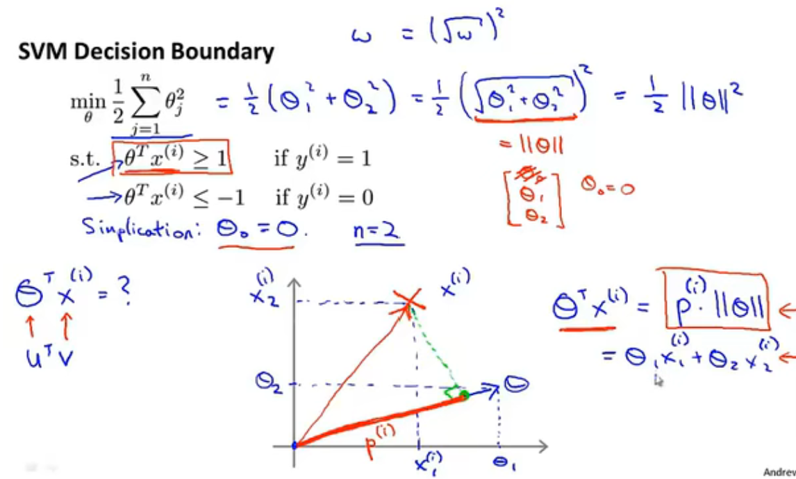
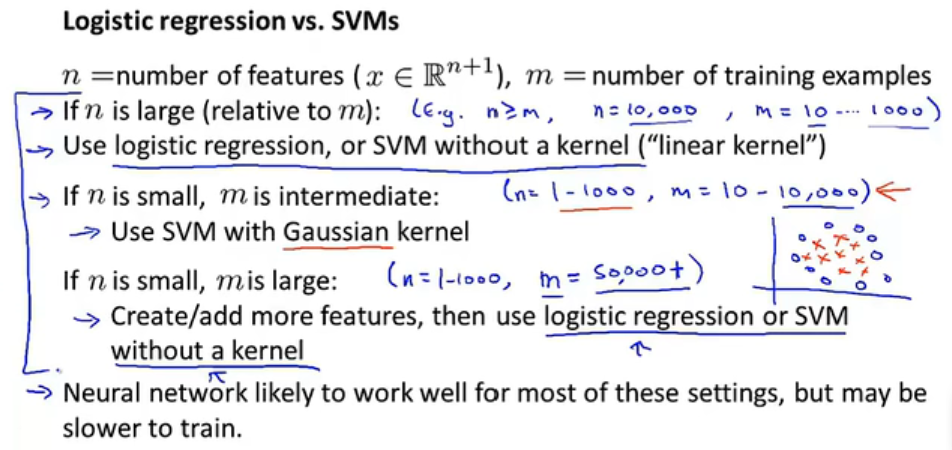

# 《机器学习&深度学习笔记》

机器学习的概述
1. 一些知识点：
    - 学习目标：算法中机器学习解决的主要问题类型，主要术语，了解不同的算法，以及每种算法的适用场景，以及应用学习算法时的实际建议。网络、自动化技术、大数据和算力的发展是让机器学习如此火热的一个原因。
    - $SOTA$ - State of the art，指代最先进的模型。
    - Octave。它是一个与MATLAB语法兼容的科学计算编程语言。使用Ovtave可以快速的建立机器学习原型，在这个算法可以工作后，再迁移到其他编译环境中。
1. 线性 vs. 非线性
    - 线性模型和非线性模型的区别：是否可以用直线将样本划分开，即决策边界是否为直线
        - 线性模型：如一元线性回归，逻辑回归(logistics - 广义线性回归模型)等。线性模型也可以是通过曲线来拟合的，但决策边界为直线。
        - 非线性模型：如神经网络。决策边界不是直线。
1. 机器学习应用实例：
    - 数据库挖掘：网页点击数据，医疗记录数据，计算生物学，工程学
    - 无法手动编写的程序应用：自动驾驶直升机，手写识别，自然语言处理（NLP-Natural language processing），计算机视觉（CV-Computer vision）等应用
    - 私人定制项目：亚马逊，视频推荐系统（自我学习）
    - 理解学习人类行为（大脑，真正的AI）
1. 机器学习定义
    - 在没有明确设置的情况下，使计算机具有学习能力的研究领域（Athrur Samuel）
    - 计算机程序从经验E中学习， 解决某一任务T，进行某一性能度量P（Probability），通过P测定在T上的表现因经验E而提高（Tom Mitchell）
1. 机器学习算法分类：
    - 监督学习（Supervised learning）：我们教计算机做某件事
    - 非监督学习（Unsupervised learning）：我们让计算机自己学习
    - 其他：强化学习，推荐系统等
1. 监督学习（Supervised learning）
    - 定义：我们给算法一个数据集，其中包含了正确答案，算法的目的就是给出更多的正确答案（数据集有标签）
    - 回归问题（Regression），预测一个连续值的输出
    - 分类问题（Classification），预测一个离散值的输出
1. 非监督学习（Unsupervised learning）
    - 定义：数据集都有相同的标签或没有标签，从数据集中找到某种结构、类型或簇
    - 聚类问题（Clustering）：我们没有提前告诉算法数据的类型或属性
    - 奇异值分解函数。SVD（Singular value decomposition）
1. 非监督学习的应用：
    - 通过基因组来识别不同类型的人群
    - 数据中心用来组织大型计算机集群，找到哪些机器趋向于协同工作，然后把这些机器放在一起，可以让数据中心更高效的工作
    - 社交网络分析。自动识别同属于一个圈子的朋友，判断哪些人可能互相认识
    - 市场细分。自动找出不同的市场分割，并自动将客户分到不同的细分市场中，从而自动高效的在不同的细分市场中进行销售。我们有全部的客户和销售数据，但预先不知道有哪些细分市场
    - 天文数据分析。帮助分析和构建星系形成的理论

---

模型描述（Model representation）
1. 定义：训练集，测试集，样本数量 $m$，输入特征 $x$，输出变量 $y$（预测目标变量），一个训练样本 $(x,y)$，第 $i$ 个索引对应的训练样本 $(x^{(i)},y^{(i)})$
    - 假设函数：模型拟合后的函数 $h(\theta)$
    - 参数：拟合后函数的参数 $\theta$
    - 代价函数：在不同的 $x$ 下，假设函数与真实值之间的误差平方和的 $\frac{1}{2m}$，

    $$
    J(\theta)=\frac{1}{2m} \sum_ {i=1} ^{m} (h_\theta(x^{(i)})-y^{(i)})^2
    $$
    
    - 目标函数：在不同的参数\theta下，取得最小的代价函数 $min J(\theta)$
1. 假设函数（Hypothesis function）。比如当解决一个实际的问题时，先考虑简单的线性函数（如：Linear regression），根据实际的效果再考虑非线性函数。格式：$$h_\theta(x) = \theta_0 + \theta_1·x$$
1. 代价函数（Cost function）。用J来表示，尽量让预测值和实际值的误差平方和最小（目标函数）。
    
    $$
    \underset{\theta_0,\theta_1}{min}J(\theta_0,\theta_1) = \underset{\theta_0,\theta_1}{min}\frac{1}{2m}(\sum_{i=1}^{m}(\hat{y^{(i)}}-y^{(i)}))^2=\underset{\theta_0,\theta_1}{min}\frac{1}{2m}(\sum_{i=1}^{m}(h_\theta(x^{(i)})-y^{(i)}))^2
    $$

    - Cost function也被称作squared error function（平方误差代价函数），是解决回归问题最常用的手段。
    - 代价函数曲线（一维）：比如假设只有一个参数 $\theta_1$，通过 $J(\theta_1)$ 与 $\theta_1$ 的关系曲线，可以看出随着\theta的变化，代价函数 $(J\theta_1)$的变化趋势曲线。那么学习算法的优化目标，就是通过选择\theta1的值，来获得最小的 $J(\theta_1)$，这就是该模型的目标函数
    - 代价函数曲线（二维）：当同时分析 $J(\theta_0,\theta_1)$和$\theta_0，\theta_1$之间的关系时，会得到一个三维曲面，找到最低点来使代价函数最小。三维曲线可以转化为二维等高线图（contour plot）来展示，等高线图的中心点就是目标值点。
    
    - 我们真正想要的一个高效的算法，是能够可以自动寻找代价函数J取得最小值时的参数 $\theta$。尤其是那些很难可视化的多参数，多维度的算法。
1. 梯度下降（Gradient descent）
    - 梯度下降法可将代价函数 $J(\theta)$最小化。被广泛用于机器学习的众多领域和众多函数中。
    - 梯度下降的思路：对于$J(\theta_0,\theta_1)$，我们给定$\theta_0$和$\theta_1$的初始值，初始值其实不关键，通常选择将$\theta_0$和$\theta_1$都设为$0$，然后不停的一点点改变$\theta_0$和$\theta_1$，来使$J(\theta_0,\theta_1)$变小，直到我们找到$J(\theta)$的最小值，或局部最小值。（联想人站在三维曲面上要下山的例子，当我们选择一个初始点要准备下山，我们会去看这个点的周围，哪个方向下山最快，然后迈出一步到达下一个点。到达下一个点后，再去看周围，再决定下山最快的方向，然后迈出一步。不断重复这个过程，直至到达最低的点）
    
1. 梯度下降算法公式：
    - （赋值运算符 := 例如a:=b，表示a取b的值的含义。整个过程不断重复直至收敛）
    - 梯度下降算法公式： 
    - Repeat until convergence {
    
    $$
    \theta_j:=\theta_j-α\frac{∂}{∂\theta_j}J(\theta_0,\theta_1),(for \ j=0,j=1)
    $$ 
    
    }
    
    

    $$
    temp0 := \theta_0-α\frac{∂}{∂\theta_0}J(\theta_0,\theta_1)$$

    $$
    temp1 := \theta_1-α\frac{∂}{∂\theta_0}J(\theta_0,\theta_1)$$
    
    $$
    \theta_0 := temp0
    $$
    
    $$
    \theta_1 := temp1
    $$

    - 计算时，$\theta_0和\theta_1$需要同时更新
    - $α$ 被称作学习率（Learning rate）。它控制着我们以多大的幅度更新参数 $\theta_j$。学习率决定了梯度下降时，我们迈出多大的步子。当α很大，我们就用大步子下山；如果 $α$ 很小，我们就用小碎步下山。学习率很小，梯度下降的速度会很慢；学习率很大，梯度下降可能会越过最低点，甚至可能会越过最低点，甚至可能无法收敛或者发散
    
    - $J'(\theta_j)$ - 表示代价函数 $J(\theta_0，\theta_1)$ 对 $\theta_j$ 求导的导数项
1. 导数项（Derivative term）。$J'(\theta_1)$ - 偏导数，用来求梯度下降的方向。当达到局部最低点时，导数项为0，迭代停止。而随着每次迭代，导数项绝对值越来越小，导致每次移动的幅度也越来越小，最终收敛到局部极小值（如果初始参数已经在局部最优点，那么梯度下降法更新其实什么都没有做，迭代并不会改变参数的值。数学知识：求最优解时，让目标函数一阶偏导为0。而要求这个偏导为0的方程，需要通过二阶偏导来继续求连续函数才能求解）
1. 线性回归的梯度下降（Gradient descent for linear regression）将梯度下降和代价函数结合，得到线性回归的算法。（导数项的求导：涉及到隐函数求导，求和公式里面的 $h(x)$ 是包含在 $(h(x)-y)^2$ 内的隐函数，也就是复合函数，复合函数求导，先对中间变量求导，在对自变量求导。偏导数求导，需要把除自身以外的变量当做常数来对待。求导过程涉及到多元微分知识）导数项求导后，分别得到\theta0和\theta1对应的偏微分导数。（梯度下降算法容易陷入到局部最优的问题）
    - Linear regression:
    
    $$
    h_\theta(x)=\theta_0+\theta_1x
    $$

    $$
    J(\theta)=\frac{1}{2m}\sum_{i=1}^{m}(h_\theta(x^{(i)})-y^{(i)})^2
    $$

    - Gradient descent:
        
        $$
        \theta_j:=\theta_j-α\frac{∂}{∂\theta_j}J(\theta_0,\theta_1)
        $$

    - Objective function:
        
        $$
        \underset{\theta_0,\theta_1}{min}J(\theta_0,\theta_1)
        $$

    - Partial derivative:
        
        $$\frac{∂}{∂\theta_j}J(\theta_0,\theta_1)
        = \frac{∂}{∂\theta_j}\bigg[\frac{1}{2m}\sum_{i=1}^{m}(h_\theta(x^{(i)})-y^{(i)})^2\bigg]
        = \frac{∂}{∂\theta_j}\bigg[\frac{1}{2m}\sum_{i=1}^{m}(\theta_0+\theta_1x^{(i)}-y^{(i)})^2\bigg]
        $$

        $$
        \frac{∂}{∂\theta_0}J(\theta_0,\theta_1)=\frac{1}{m}\sum_{i=1}^{m}(h_\theta(x^{(i)})-y^{(i)}),(j=0)
        $$

        $$
        \frac{∂}{∂\theta_1}J(\theta_0,\theta_1)=\frac{1}{m}\sum_{i=1}^{m}(h_\theta(x^{(i)})-y^{(i)})·x^{(i)},(j=1)
        $$

    - Repeat until convergence {
        
        $$
        \theta_0:=\theta_0-α\frac{1}{m}\sum_{i=1}^{m}(h_\theta(x^{(i)})-y^{(i)})
        $$

        $$
        \theta_1:=\theta_1-α\frac{1}{m}\sum_{i=1}^{m}(h_\theta(x^{(i)})-y^{(i)})·x^{(i)}
        $$
        
        }

1. 凸函数（Convex function）。又称弓形函数（Bow shaped function）如线性回归代价函数的三维曲面形状。没有局部最优解（Local optimum），只有一个全局最优（Global optimum）
    
1. 批量梯度下降（Batch gradient descent）。意味着每次梯度下降，我们都遍历了整个训练集样本，在计算偏导时计算总和。在每一个单独的梯度下降，我们计算m个训练样本的总和。（所以批量梯度下降，指的就是分析整个训练集。对于其他非批量的梯度下降方法，每一步关注的就不是整个训练集，而是其中的小子集。）
    - 求解代价函数J的最小值，可以不需要使用像多步骤的梯度下降的迭代算法（Iterative algorithm），比如正规方程组方法（Normal equations methods）。相比于这种方法，梯度下降法适用于更大的数据集

---
矩阵和向量（Matrix and vectors）
1. 线性代数（Linear algebra）
1. 矩阵（Matrix）：由数字组成的矩形阵列，也称二维数组。矩阵的维数表示为：行数 * 列数。$A_{(ij)}$指代矩阵中的某个具体元素
1. 向量（Vector）：向量是只有一列的矩阵。这一列对应的元素数，称为向量的维度。通常用大写字母表示矩阵，小写字母来表示向量
1. 标量乘法（Scalar multiplication）
1. 矩阵向量乘法（Matrix-vector multiplication）
    - 矩阵乘以向量： $(m\times n)$ 乘以 $(n\times 1)$ 向量，得到 $(m\times 1)$ 向量
    - 应用实例小技巧☆：一系列输入 $x [2104，1416，1534，852]$，假设函数 $h(x) = -40+0.25x$，用矩阵乘法的思维来快速计算。转化为矩阵 $（[1,2104]; [1,1416]; [1,1534]; [1,852]）$ 与向量 $[-40; 0.25]$ 的乘法来计算。计算机在处理矩阵计算时的计算效率更高，如果不转化为矩阵，则需要通过for循环实现这类计算。
1. 矩阵乘法（Matrix multiplication）
    - 矩阵$(m\times n)$与$(n\times s)$相乘，最后得到$(m\times s)$矩阵。（口诀：中间相等取两头）- （top10的变成语言中都有经过高度优化过的矩阵库，可以帮助高效来做矩阵乘法，甚至可以多核并行计算来更高效的完成多个假设函数的预测结果）
    - 矩阵乘法不满足交换律，但服从结合律。$$A×B≠B×A，A×(B×C) = (A×B)×C$$
    - 单位矩阵（Special matrix）。记作$I(n*n)$，$n$表示矩阵的维度，$n * n$单位矩阵。单位矩阵的特性，对角线的数字都为1，其他位置都为0。对于任何的单位矩阵$I$，$$A·I = I · A = A$$
1. 特殊的矩阵计算
    - 矩阵逆运算（Matrix inverse）。$$A·A^{(-1)} = A^{(-1)}·A = I$$ $A$ 为方阵，只有方阵才有逆运算。
    - 方阵（Square matrix）- 矩阵的行数和列数相等
    - 奇异矩阵（Singular matrix）或退化矩阵（Degenerate matrix）：不存在逆矩阵的矩阵，比如都为0的矩阵，或不是方阵的矩阵
1. 矩阵转置运算（Matrix transpose）
    - 转置矩阵 $A → A^T$。相当于画了一条-45°的线，矩阵A以这条线为轴进行翻转，得到$A^T$（行列互换）
    - 标准定义：$A$为$(m * n)$矩阵，$B$为$A$的转置，$B=A^T$，则$B$为$(n*m)$矩阵，那么$B_{(ij)} = A_{(ji)}$
    

---
多元特征（Multiple features）
1. 特征向量（Feature vector）。$x^{(2)} = [124,125,34,2]$表示一个四维特征向量，$(2)$表示索引。$x^{(i)}_j$表示第$i$个训练样本中第$j$个特征量的值。
    - 对于一个多元线性回归问题（Multivariate linear regression），变量 $$x=[x_0; x_1; x_2; x_3...x_n]$$ 特征 $$\theta=[\theta_0; \theta_1; \theta_2; \theta_3...\theta_n]$$ 假设函数$$h_\theta(x) = \theta_1x_1 + \theta_1x_1 + ... +\theta_nx_n = \theta^T·x$$
1. 多元梯度下降法（Gradient descent for multiple variables）
    - 梯度下降的通俗理解：（迭代一轮后的参数 $\theta$） = （迭代前的参数 $\theta$） - 学习率 $\alpha \times$（代价函数$J(a,b,c...n)$对参数$\theta$的偏导数）
    
    - Hypothesis 
    
    $$ 
    h_{\theta}(x)=\theta^Tx=\theta_0x_0+\theta_1x_1+\theta_2x_2+···+\theta_nx_n 
    $$
    
    - Parameters: 
    
    $$ 
    \theta_0,\theta_1,\theta_2,...,\theta_n 
    $$

    - Cost function: 
    
    $$ 
    J(\theta_0,\theta_1,\theta_2,...,\theta_n) = \frac{1}{2m} \sum_{i=1}^{m}(h_\theta(x^{(i)})-y^{(i)})^2 
    $$

    - Gradient descent - Repeat
        {
            
        $$ 
        \theta_j:=\theta_j-α\frac{∂}{∂\theta_j}J(\theta_0,\theta_1,\theta_2,...,\theta_n)=\theta_j-α\frac{1}{m} \sum_{i=1}^{m}(h_\theta(x^{(i)})-y^{(i)})·x^{(i)}_j 
        $$

        } 

    - （Simultaneously update for every j=0,1,2,···,n）just like:{ 
        
        $$
        \theta_0:=\theta_0-α\frac{1}{m} \sum_{i=1}^{m}(h_\theta(x^{(i)})-y^{(i)})
        $$
        
        $$
        \theta_1:=\theta_1-α\frac{1}{m} \sum_{i=1}^{m}(h_\theta(x^{(i)})-y^{(i)})·x^{(i)}_1
        $$    
        
        $$
        \theta_2:=\theta_2-α\frac{1}{m} \sum_{i=1}^{m}(h_\theta(x^{(i)})-y^{(i)})·x^{(i)}_2
        $$   
        
        $$
        ···
        $$

        }

1. 特征缩放（Feature scaling）
    - 让特征都在同一个量纲范围内，这样梯度下降法会更快地收敛（Converge）。特征缩放后，代价函数的等高线图就没有很严重的偏移情况，这样可以更容易的找到更直接更短的道路到达全局最小点，速度也会更快。
    - 特征缩放，是将特征的取值约束到$（-1,1）$的范围内，共同除以某一个值。
    - 归一化（Normalization）。所有的值都减去均值，再除以特征的范围（最大值减最小值），这样让特征值拥有为0的平均值。或者可以除以特征的标准差来计算（标准化）。
    - 特征缩放的意义：无论是采用什么方式，原理和取值都是非常近似的，只要将特征值转换为相近似的范围都是可以的。特征缩放并不需要太精确，只是为了让梯度下降能够运行的更快，迭代的次数更少而已。
1. 学习率（Learning rate）
    - 实际应用过程中一般会绘制梯度下降曲线，横坐标为迭代次数（No. of iterations），纵坐标为最小代价函数$（minJ(\theta)）$。如果模型正常工作的话，每一步迭代之后J（\theta）都应该下降。 从这个曲线可以看出经过多少次迭代后，梯度下降算法已达到收敛，不再继续下降。很难预先判断梯度下降算法，需要多少步迭代才能收敛，不同应用需要的收敛步骤差异很大
    - 自动收敛测试（Automatic convergence test）：比如设定一步迭代后代价函数的降低的量的阈值 $\epsilon< 10^{(-3)}$，就判断函数已经收敛。但实际应用由于很难弄设定这个阈值，所以更多的还是通过绘制曲线来看变化趋势和幅度。
1. 学习率 $α$ 的选择
    - 如果代价函数 $J(\theta)$ 没有随着迭代次数的增加而稳定降低，需要减小学习率 $α$。（学习率 $α$ 大，迭代快，但可能不收敛（增加或不规律跳动）；学习率 $α$ 小，迭代慢，迭代次数多，更容易收敛）。
    - 有相关证明表示，只要学习率 $α$ 足够小，代价函数 $J(\theta)$ 都会逐渐降低。实际应用中，通常多尝试几组学习率的值，间隔几倍 $(α=0.001, 0.01, 0.1...$ 等，或者3倍 $α = 0.003, 0.03, 0.3...）$。对于大数据样本，加速收敛就是刚开始选择大学习率，然后随着迭代不断地减小学习率
1. 特征与多项式回归（Feature & polynomial regression）
    - 构造新特征。比如通过房屋的长、宽构造房屋的面积特诊，进而预测房屋价格和面积之间的关系（注：当构造的新特征量纲过大时，要记得特征缩放）
    - 构造新特诊，并自由选择和设计特征组合，从而能够用更复杂的函数来拟合数据
1. 正规方程（Normal equation）
    - 正规方程法在少数算法中适用（如：线性回归）；而在其他算法中不适用，比如分类或逻辑回归算法等，这种情况仍然需要用梯度下降法
    - 基于迭代算法的思维，梯度下降法（Gradient descent）可以帮助找到参数的最优值 $\theta$。而正规方程提供了一种求解\theta的解析解法，可直接一次性的求解到最优值。正规方程解法。如二次函数，先求导（Take derivatives），将导数置 $0$ ，然后求得对应 $\theta$（微积分calculus思路）。
1. 正规方程法公式：使代价函数最小化的求解公式 

$$
\theta = (X^{T}·X)^{-1}·X^{T}·y
$$

$\theta$ 为$X$转置乘以$X$的逆，乘以$X$转置，乘以$y$。（此方法不需要做特征缩放）
    - 乘以转置的目的是为了确保它有逆矩阵，不然没法计算 
    - 矩阵的秩（Rank）：方程组中真正是干货的方程个数，就是这个方程组对应的秩。秩是列空间的维度，也是图像经过矩阵变化之后的空间维度
    - 满秩矩阵（Full rank）：矩阵的满秩包括行满秩和列满秩，既是行满秩又是列满秩的话一定是方阵。满秩方阵可逆，可逆矩阵一定是方阵。而且「秩」=「列秩」=「行秩」是恒成立的
1. （正规方程法和梯度下降法优劣对比）$m$-训练样本，$n$-特征数量。
    - 正规方程法：优：①不需要选择学习率②不需要迭代；劣①需要计算矩阵转置和逆（$n*n$的复杂度，计算量以$n^3$的数量级增长）②当$n$很大时，计算会非常慢
    - 梯度下降法：优：当$n$很大时也可以很好工作；劣：①需要选择学习率；②需要很多次迭代
    - 经验做法： $n>10000$时，可以倾向于梯度下降法
1. 正规方程的不可逆性（Normal equation & non-invertibility）
    - 不可逆的矩阵为：奇异矩阵（Singular）或退化矩阵（Degenerate）
    - 不可逆的原因：冗余特征（如：线性相关），特征太多（如 $m < n$，解决办法-删除特征或正则化（Regularization））

---
代码操作-Octave
1. Octave开源，与matlab语法高度兼容。与之对应的是python numpy
2. 向量化（vectorized implementation），相比于for循环的运算速度会更快，会让代码运行的更高效

---
逻辑回归（Logistic regression）和分类（Classification）
1. 离散型变量的预测问题
    - 正例（Positive class）：表示具有我们要寻找的东西，负例（Negative class）：表示没有某样东西。（但正负并没有明确规定，也不重要）
    - 逻辑回归（Logistic regression）算法是一种分类算法，输出结果在0~1之间

1. 假设表示（Hypothesis representation）。Logisitc function 等同于 Sigmoid function 
$$
g(z) = \frac{1}{1+e^{(-z)}}
$$

1. 逻辑回归模型的假设函数 $(0≤h_\theta(x)≤1)$ 

    $$ 
    h_\theta(x) = g(\theta^T·x) = \frac{1}{1+e^{(-\theta^T·x)}}
    $$

    - 模型的解释（interpretation）：依赖假设和输入变量来估计 $y=1$ 的概率

    $$ 
    h_{(\theta)}=P(y=1|x;\theta) 
    $$

    $$ 
    P(y=0|x;\theta)+P(y=1|x;\theta)=1 
    $$

    $$ P(y=0|x;\theta)=1-P(y=1|x;\theta) $$

1. 决策边界（Decison boundary）：
    - 使用Sigmod函数的意义在于将（-∞，+∞）映射到了（0，1）上，映射后函数横轴小范围内变化灵敏，大范围内变化平缓。
    - 对于$$ h_\theta(x) = g(\theta^T·x) = \frac{1}{1+e^{(-\theta^T·x)}}$$，求解过程相当于让 $\theta^T·x≥0$时，即 $h_\theta(x)>0.5$的边界，按照sigmoid函数即 $h_\theta(x)=1$ 的范围（>0.5就会被归为=1的类别中）。$h_\theta(x)=0.5$ 即为决策边界。决策边界是假设函数的一个属性，不受数据集的影响。
1. 非线性决策边界（Non-linear decision boundaries)
    - 决策边界不是训练集的属性，而是假设本身及其参数的属性，只要给定了 $\theta$，非线性的决定边界就能够确定了（训练集用来拟合$\theta$，$\theta$确定了决策边界）
    - 对于假设函数为更高阶多项式的情况，将计算得到更复杂的决策边界。Logistic regression将用于寻找决策边界。

1. 代价函数/损失函数（Cost function）。对于实际值是 $y$，但是学习算法给出的预测值是 $H$，那就需要让这个算法付出代价。
    - 非凸函数（Non-convex function）。如果将线性回归方法的代价函数公式直接应用在逻辑回归中，$J(\theta)$为非凸函数（因为Sigmoid函数形式导致的）。但我们希望代价函数是一个凸函数(Convex function)，即单弓形函数（Bow-shaped funciton），对于凸函数使用梯度下降法，会收敛得到该函数的全局最小值。

    - Logistic regression函数的代价函数，求导！
    - Training set:
    {
        
        $$
        \{(x^{(1)},y^{(1)}),(x^{(2)},y^{(2)}),...,(x^{(n)},y^{(n)})\} 
        $$
        
        }
    - $m$ Examples:

    $$ x∈
    \begin{bmatrix}
    x_0\\
    x_1\\
    ···\\
    x_n\\
    \end{bmatrix}
    ,x_0=1,y∈\{0,1\}
    $$
    - Hypothesis: 
    $$ h_\theta(x) = g(\theta^T·x) = \frac{1}{1+e^{(-\theta^T·x)}}$$

    - Logistic regression cost function:
    $$
    Cost(h_{\theta}(x),y)=
    \left\{\begin{matrix}
    -\log(h_\theta(x)),(y=1)\\
    -\log(1-h_\theta(x)),(y=0)
    \end{matrix}\right.
    $$
    
    $$
    = -y\log(h_\theta(x))-(1-y)\log(1-h_\theta(x))
    $$

    
    $$
    J{(\theta)}=\frac{1}{m}\sum_{i=1}^{m}Cost(h_{\theta}(x^{(i)}),y^{(i)}) = -\frac{1}{m}\bigg[\sum_{i=1}^{m}\Big(y^{(i)}\log h_{\theta}(x^{(i)})+(1-y^{(i)})\log(1-h_\theta(x^{(i)}))\Big)\bigg]
    $$

    - To fit parameter $\theta$:
    $$
    \underset{\theta}{min} J(\theta)
    $$

    - Gradient descent - Repeat {
    $$
    \theta_j:=\theta_j-\alpha\frac{\partial}{\partial\theta_j}J(\theta), (simultaneously \ update \ all \ \theta_j)
    $$ } 
    

    - To make a prediction given new $x$:
    $$
    Output:h_\theta(x)=\frac{1}{1+e^{(-\theta^Tx)}},(P(y=1|x;\theta))
    $$

    - （理解：当$y=1$时，如果$h_\theta(x)=1$，那么$cost=0$；如果$h(\theta)→0，cost→∞$，也就意味着这种极端错误的情况，我们将会用很大的力度来惩罚这个算法，也就是说算法要为这个错误付出的代价。$y=0$ 的情况下同理）

1. 简化代价函数和梯度下降（Simplified cost function and gradient descent）。逻辑回归的代价函数是从统计学中的极大似然法得来的，它是统计学中为不同的模型快速寻找参数的方法，同时它还有一个很好的性质，它是凸函数。因此这个代价函数成为了logistic回归模型最常用的代价函数。使用梯度下降法来求代价函数的最小值，进而拟合参数\theta

    - 逻辑回归算法的梯度下降公式虽然看起来和线性回归一样，但假设的定义发生了改变，假设函数 $h_\theta(x)$不一样了）。
    - 对于线性回归
    $$
    h_\theta(x) = \theta^T·x
    $$

    - 对于逻辑回归
    $$
    h_\theta(x) = \frac{1}{1+e^{(-\theta^T·x)}}
    $$

    - 特征缩放同样可以应用于逻辑回归算法，让梯度下降的收敛速度更快。
    - 逻辑回归是很强大，有可能是世界上最广泛的一种分类算法。
1. 高级优化算法（Advanced optimization algorithm）。
    - 共轭梯度法Conjugate gradient，$BFGS，L-BFGS$。这类算法的优点：不需要手动选择学习率α，比梯度下降法的收敛速度更快；但缺点是更复杂。这类算法的内部包含一种叫做线搜索算法（Line search algorithm）的方法，它可以自动尝试不同的学习速率α，并选择一个好的学习速率α，它甚至可以为每次迭代选择不同的学习速率，这样你就不需要自己选择。 
1. 多类别分类（Multi-class classification）。用逻辑回归方法来解决多类别分类问题。一对多分类算法（One-vs.-all classificaiton，或者叫One-vs.-rest）。二元分类（Binary classification）
    - 举例：一个3分类问题，训练生成3个二分类器。当一个新的x进来时，全部输入到3个分类器中，全部进行判别，选概率值（即$h_\theta(x)$）最高的那个分类器，即为这个x对应的类别 。通过这个过程就确定了x要选择的分类器，这个分类器对于x的可信度最高，效果最好。
    

---
过拟合（Overfitting），代价函数（Cost function），正则化（Regularization）：
1. 欠拟合（Underfitting）：算法没有很好的拟合训练集，具有高偏差（High bias）；过拟合（Overfitting）：算法过度拟合训练集，具有高方差（High variance）。
1. 过拟合（Overfitting）：通常会在变量过多的时候出现，这时训练出的假设能很好地拟合训练集，所以你的代价函数可能非常接近于0，但这样你可能会得到一个方程，它千方百计地拟合训练集，导致它无法泛化到新的样本中，无法预测新样本的结果

1. 泛化（Generalize）：一个假设模型应用到新样本的能力。调试（Debug）和诊断（Diagnose）
1. 避免过拟合的方法：
    - 减少特征/变量的数量：
    - 手动选择保留哪些特征（删除特征可能会导致信息丢失）
    - 模型自动选择算法 - Model selection algorithm
1. 正则化（Regularization）
    - 保留所有的特征，但是减少量级或参数 $\theta$ 的大小。我们在函数中加入惩罚项（Penalize），在代价函数中加入要惩罚的某些参数\theta（有时会带一个很大的常数系数-惩罚项），那么这些参数就会很小，从而弱化这些参数对假设函数的影响
    - 特征:
    $$
    [x_1,x_2,x_3,···,x_m]    
    $$
    
    - 参数:
    $$
    [\theta_0,\theta_1,\theta_2,···,\theta_n]
    $$
    
    - 代价函数Cost function:
    $$
    J(\theta)=\frac{1}{2m}\bigg[\sum_{i=1}^{m}(h_\theta(x^{(i)})-y^{(i)})^2+\lambda\sum_{j=1}^{n}\theta_j^2\bigg]
    $$

    - 正则化的思想：如果我们的参数值 $\theta$ 较小，参数较小意味着假设模型会变得更简单。正则化之后的代价函数是在代价函数的后面，加上一个额外的正则化项，这个项的作用是来缩小每个参数 $\theta$ 的值。正则化的目标，是为了控制两个不同目标之间的取舍，第一个目标，与目标函数的第一项有关，让算法尽可能的去拟合训练数据集；第二个目标，我们要保持参数尽量地小，与正则化的目标有关。正则化项前面的系数λ，即正则化参数，作用是控制这两个目标之间的平衡。即更好地去拟合训练集的目标和将参数控制得更小的目标（减小不重要特征参与计算的权重），从而保持假设模型的相对简单，避免出现过拟合的情况。

1. 线性回归正则化
    - 梯度下降（Gradient descent）or 正规方程（Normal equation）法应用正则化后 $\theta$ 的求解方法

    - 线性回归，加入正则化项之后，代价函数为：
    $$
    J(\theta)=\frac{1}{2m}\bigg[\sum_{i=1}^{m}(h_\theta(x^{(i)})-y^{(i)})^2+\lambda\sum_{j=1}^{n}\theta_j^2\bigg]
    $$
    
    - 对比<不加入正则化>的线性回归梯度下降，重复{

    $$
    \theta_0:=\theta_0-\alpha\frac{1}{m}\sum_{i=1}^{m}(h_\theta(x^{(i)})-y^{(i)})·x_0^{(i)}
    $$

    $$
    \theta_j:=\theta_j-\alpha\frac{1}{m}\sum_{i=1}^{m}(h_\theta(x^{(i)})-y^{(i)})·x_j^{(i)}
    $$

    $$
    (x_0=1,j=0,1,2,···,n)
    $$

    }
    - <加入正则化>的线性回归梯度下降，重复{

    $$
    \theta_0:=\theta_0-\alpha\frac{1}{m}\sum_{i=1}^{m}(h_\theta(x^{(i)})-y^{(i)})·x_0^{(i)}
    $$
    
    $$
    \theta_j:=\theta_j-\alpha\frac{1}{m}\sum_{i=1}^{m}(h_\theta(x^{(i)})-y^{(i)})·x_j^{(i)}+\frac{\lambda}{m}\theta_j
    $$
    
    $$
    即\theta_j:=\theta_j(1-\alpha\frac{\lambda}{m})-\alpha\frac{1}{m}\sum_{i=1}^{m}(h_\theta(x^{(i)})-y^{(i)})·x_j^{(i)}
    $$

    $$
    \{x_0=1,(1-\alpha\frac{\lambda}{m})<1,(j=1,2,···,n)\}
    $$ }

1. 正规方程正则化，解决不可逆的问题（进阶数学）
    - 假设样本数量 $m \leq $特征数量 $n$
    $$\theta = (X^{T}·X)^{-1}·X^{T}·y$$
    - 此时，$X^{T}·X$ 不可逆，$(X^{T}·X)^{-1}$无解，为奇异矩阵。如果正则项系数 $\lambda>0$,那么可通过加入正则化项来求解，如下：

    $$
    \theta = \left(X^{T}·X+\lambda
    \begin{bmatrix}
    0 &&&&\\
    &1&&&\\
    &&1&&\\
    &&&\ddots&\\
    &&&&1
    \end{bmatrix}
    \right)
    ^{-1}·X^{T}·y
    $$

1. 逻辑回归正则化（Regularized logistic regression）
    - 不加正则化项 - 原始的逻辑回归，假设函数为：
    $$
    h_\theta(x)=g(\theta0+\theta_1x_1+\theta_2x_1^2+\theta_3x_1^2x_2+\theta_4x_1^2x_2^2+\theta_5x_1^2x_2^3+···)
    $$

    - 代价函数 Cost function：
    $$
    J{(\theta)}=\frac{1}{m}\sum_{i=1}^{m}Cost(h_{\theta}(x^{(i)}),y^{(i)}) = -\frac{1}{m}\bigg[\sum_{i=1}^{m}\Big(y^{(i)}\log h_{\theta}(x^{(i)})+(1-y^{(i)})\log(1-h_\theta(x^{(i)}))\Big)\bigg]
    $$

    - 梯度下降 Gradient descent,重复直至收敛{

    $$
    \theta_0:=\theta_0-\alpha\frac{\partial}{\partial\theta_0}J(\theta)=\theta_0-\alpha\frac{1}{m}\sum_{i=1}^{m}(h_\theta(x^{(i)})-y^{(i)})x_0^{(i)}
    $$

    $$
    \theta_j:=\theta_j-\alpha\frac{\partial}{\partial\theta_0}J(\theta)=\theta_j-\alpha\frac{1}{m}\sum_{i=1}^{m}(h_\theta(x^{(i)})-y^{(i)})x_j^{(i)}
    $$

    $$
    (其中：h_\theta(x)=\frac{1}{1+e^{(-\theta^Tx)}},x_0=1,j=0,1,2,····,n)
    $$
    
    }

    - （→Regularized）加了正则化项之后，逻辑回归代价函数（Cost function）：
    $$
    J{(\theta)} = -\frac{1}{m}\bigg[\sum_{i=1}^{m}\Big(y^{(i)}\log h_{\theta}(x^{(i)})+(1-y^{(i)})\log(1-h_\theta(x^{(i)}))\Big)\bigg]+\frac{\lambda}{2m}\sum_{j=1}^{n}\theta_j^2
    $$

    - 梯度下降 Gradient descent,重复直至收敛{

    $$
    \theta_0:=\theta_0-\alpha\frac{1}{m}\sum_{i=1}^{m}(h_\theta(x^{(i)})-y^{(i)})x_0^{(i)}
    $$

    $$
    \theta_j:=\theta_j-\alpha\bigg[\frac{1}{m}\sum_{i=1}^{m}(h_\theta(x^{(i)})-y^{(i)})x_j^{(i)}+\frac{\lambda}{m}\theta_j\bigg]
    $$

    $$
    (其中：h_\theta(x)=\frac{1}{1+e^{(-\theta^Tx)}},x_0=1,j=1,2,····,n)
    $$ }

1. 非线性假设（Non-linear hypotheses）
    - 神经网络（Neural network）。对于不确定的特征组合问题，遍历特征会使特征空间急剧膨胀。当特征个数 $n$很大时，增加特征来建立非线性分类器并不是一个好的做法。神经网络在学习复杂的非线性假设上被证明是一种好得多的方法。
    - 图像识别问题举例：对于 $50\times50$ 像素点的图片，灰度值处理后会有 $2500$ 个像素点，每个像素点代表图片的一个特征，所以这个图片的特征维度共有 $2500$ 维。如果是RGB处理，那么将会产生 $7500$ 个像素点（由红绿蓝三种颜色，不是灰色）
    - 神经网络算法表示（Represent）。通常如果第一个假设函数为逻辑回归单元，那么则称为带有Sigmoid或Logistic激活函数（Sigmoid（Logistic）Activation function）的人工神经元。激活函数是指代非线性函数的另一个术语（如下公式）。 在神经网络的说法中，通常也会把参数 $\theta$ 称为权重（Weight）  

    $$
    g(z) = \frac{1}{1+e^{(-z)}} 
    $$
    
    - 神经网络是一组神经元连接在一起的集合。输入层（Input layer）包含了各种输入特征 $x$，输出层（Output layer）包含了假设的最终计算结果，隐藏层（Hidden layer）包含了除去输入层和输出层外的其他所有层（可以有很多层）
    - 神经网络中， $a^{(j)}_i$ 表示了在 $j$ 层第 $i$ 个单元的激活项，激活项表示由一个具体的神经元计算并输出的值。神经网络被这些矩阵参数化，$\Theta^{(j)}$ 就是权重矩阵，它控制着第一层到第二层，或第二层到第三层的映射（ $\Theta$ 下标对应关系，上标对应在神经网络的第几层）。
    - 激活函数：$a_i^{(j)}$ = "activation" of unit $i$ in layer $j$
    - 权重矩阵：$\Theta^{(j)}$ = matrix of weights controlling function mapping from layer $j$ to layer $j+1$. 神经网络被这些矩阵参数化
     

    - 神经网络计算假设输出的步骤。通过输入特征+权重矩阵，计算出隐藏单元的激活值（这些激活值都是神经元输入特征的加权线性组合），利用这些值来计算得到最终输出的假设函数 $h_\Theta(x)$
    - 神经网络计算向量化（Vector）计算实现方法。前向传播（Forward propagation）：从输入单元的激活项开始，然后进行前向传播给隐藏层，计算隐藏层的激活项，然后我们继续向前传播，并计算输出层的激活项。这样来依次计算激活项，从输入层到隐藏层再到输出层的过程叫前向传播。
    - 神经网络做的事就是：就像逻辑回归，但它不是使用原本的 $x1，x2...$ 作为特征来训练逻辑回归，而是用计算得到的激活项 $a1，a2...$ 作为新的特征，自己训练逻辑回归。从第一层到第二层，也对应着不同的参数 $\Theta$（这里 $\Theta$ 大写，跟单一算法的参数小写 $\theta$ 区分开）根据参数的选择不同，有时可以学习到一些很有趣和复杂的特征，就可以得到一个很好的假设函数。神经网络利用隐藏层，计算更复杂的特征，并输入到最后的输出层，以及学习到更复杂的假设函数。（本质上有点类似于“循环嵌套自动调优”的逻辑回归组合）
    - 偏置单元（Bias unit）。神经网络中单独添加的神经元项，偏置单元的参数 $\theta$ 为1，通常可设定为常数项。不一定非要添加在输入层，在隐藏层也可以添加。
    

    - 激活函数 - Sigmoid函数：

    $$
    g(z) = \frac{1}{1+e^{(-z)}} 
    $$
    
    - 隐藏层激活值计算过程：

    $$
    a_1^{(2)}=g(\Theta_{10}^{(1)}x_0+\Theta_{11}^{(1)}x_1+\Theta_{12}^{(1)}x_2+\Theta_{13}^{(1)}x_3)
    $$

    $$
    a_2^{(2)}=g(\Theta_{20}^{(1)}x_0+\Theta_{21}^{(1)}x_1+\Theta_{22}^{(1)}x_2+\Theta_{23}^{(1)}x_3)
    $$

    $$
    a_3^{(2)}=g(\Theta_{30}^{(1)}x_0+\Theta_{31}^{(1)}x_1+\Theta_{32}^{(1)}x_2+\Theta_{33}^{(1)}x_3)
    $$

    - $\Theta^{(1)}$ 是第一层到第二层的参数矩阵或权重矩阵。控制着从三个输入单元到三个隐藏单元的映射参数矩阵，那么 $\Theta^{(1)}$ 就是一个 $3\times4$ 的矩阵，表示为 $\Theta^{(1)}\in \mathbb R^{3\times4}$。
    - $\Theta^{(2)}$ 控制从第二层即隐藏层的3个单位，到第三层的一个单元（即输出单元）的映射：

    $$
    h_\Theta(x)=
    a_1^{(3)}=g(\Theta_{10}^{(2)}a_0^{(2)}+\Theta_{11}^{(2)}a_1^{(2)}+\Theta_{12}^{(2)}a_2^{(2)}+\Theta_{13}^{(2)}a_3^{(2)})
    $$
    
    - 通用定义：if network has $s_j$ units in layer $j$, $s_{j+1}$ units in layer $j+1$, then $\Theta^{(j)}$ will be of dimension $s_{j+1} \times (s_j+1)$. 
    

1. 神经网络架构（Neural network architecture）。即神经网络中不同神经元的连接方式。每一层都会基于上一层的计算结果，作为本层计算的新的特征，并结合复杂的输入层功能，在本层计算得出更复杂的特征，每一层重新训练出的特征都会更加复杂，从而最终得到非常有趣的非线性假设函数。

1. 神经网络如何训练复杂的非线性假设模型。如何解决异（ $XOR$ - Exclusive OR ：两个值不相同，结果为1，相同为0）或和同或（ $XNOR$ - Exclusive Not OR：两个值相同，结果为1，不同为0）问题？通过不断选择每个神经元特征的权重和偏置，神经网络假设函数就可以实现逻辑上的与或非（先在中间层按照通常或与非的逻辑关系转化，然后再通过这个逻辑关系计算得到的结果，进一步实现XOR和XNOR的问题。即通过中间层转化来间接实现）

1. 神经网络多元分类（Multi-class classification）。神经网络解决多分类问题，本质上是（一对多法，one-vs.-all）的拓展。比如四分类问题，最终通过神经网络形成4个独立的逻辑回归模型，分别对应了四个类别。

---
神经网络代价函数（Cost function）
1. 神经网络分类问题：

    - 输入样本
    $$
    \{(x^{(1)},y^{(1)}),(x^{(2)},y^{(2)}),...,(x^{(m)},y^{(m)}) \}
    $$

    - 神经网络层数 $L$ （= total no. of layers in network，如图 $L=4$）
    - 每层单元数（不包含偏置单元） $s_l$ (=no. of units(not counting bias unit) in layer $l$，如图 $s_1=3, s_2=s_3=5, s_4=s_l=4$)

    - 对于多分类问题，结果输出（$K$类）
    $$
    h_\Theta(x)\in\mathbb R^K, 如图 h_\Theta(x)=
    \begin{bmatrix}
    1\\
    0\\
    0\\
    0
    \end{bmatrix},
    \begin{bmatrix}
    0\\
    1\\
    0\\
    0
    \end{bmatrix},
    \begin{bmatrix}
    0\\
    0\\
    1\\
    0
    \end{bmatrix},
    \begin{bmatrix}
    0\\
    0\\
    0\\
    1
    \end{bmatrix}
    $$

    - 激活函数（Sigmoid / Logistic regression）的代价函数 Cost function 为：
    $$
    J{(\theta)} = -\frac{1}{m}\bigg[\sum_{i=1}^{m}\Big(y^{(i)}\log h_{\theta}(x^{(i)})+(1-y^{(i)})\log(1-h_\theta(x^{(i)}))\Big)\bigg]+\frac{\lambda}{2m}\sum_{j=1}^{n}\theta_j^2
    $$
    
    - 神经网络的代价函数为：

    $$
    J(\Theta) = -\frac{1}{m}\bigg[
        \sum_{i=1}^{m}\sum_{k=1}^{K}
        y_k^{(i)}\log(h_\Theta(x^{(i)}))_k+(1-y_k^{(i)})\log(1-(h_\Theta(x^{(i)}))_k)
        \bigg]+
        \frac{\lambda}{2m}
        \sum_{l=1}^{L-1}
        \sum_{i=1}^{s_l}
        \sum_{j=1}^{s_l+1}
        (\Theta_{ji}^{(l)})^2
    $$

    $$
    h_\Theta(x)\in\mathbb R^K,(h_\Theta(x))_i = i^{th}\ output
    $$
    - 说明：神经网络中不再只有一个逻辑回归输出单元，而是有 $K$ 个， $h_\Theta(x))_i$ 来表示第 $i$ 个输出，$i$ 表示选择输出神经网络向量中的第 $i$ 个元素。 $J(\Theta)$ 表示 $K$ 个输出单元之和，即 $K$ 个逻辑回归算法的代价函数之和
    - 正则化项求和，对应的是每一项 $\Theta_{ji}^{(l)}$。 这里要除去那些对应偏差单元的项，比如不对 $i=0$ 的项进行求和（ $\Theta_{10}^{(2)}x_o, \Theta_{10}^{(2)}a_0 ...$ ），因为我们不想让偏差单元被正则化，并把这些项设定为 0。

1. 一个训练算法，在给定训练集时，为神经网络拟合参数。神经网络的激活函数， $K$ 维对应 $K$ 个训练模型，所以常规项的计算结果要进行 $K$ 维求和。正则化项要进行三层求和累加（从左到右依次是“层-行-列”，层范围 $（1，l-1）$，行范围 $（1，sl）$ ，列范围 $（1，sl+1）$，加1的原因是因为输入层加了偏置项（Bias unit）。最后三维度累加将正则化项求和）

1. 神经网络为什么要加偏置项？
    - 偏置项（Bias unit），有些资料里也称偏置项为截距项（intercept term），它其实就是截距，与线性方程中 $y=wx+b$ 的意义是一致的， $b$ 控制着函数偏离原点的距离，在神经网络中的偏置单元也是类似的作用。在神经网络中加入偏置项，能够提升函数的灵活性，提高神经元的拟合能力。
    - 因此，神经网络的参数也可以表示为 $(W,b)$， $W$ 表示参数矩阵， $b$ 表示偏置项或截距项。
    - 神经元中， $Output = \sum(Weights \times Inputs) + Bias$，偏置实际上是对神经元激活状态的控制。如下图示例，当偏置为20时， $x$ 较小时 $y$ 就可以取到很大的值，从而较快的将神经元激活。  
    

2. ☆反向传播（Backpropagation algorithm）。目的是为了让神经网络代价函数最小。在神经网络中的代价函数通过反向传播或前向传播的方式，来提高预测的准确率，然后在梯度下降的时候，为了找到合适的速度以及方式，需要优化偏导项，也就是求偏导项的最小值。
    - 神经网络的代价函数
    $$
    J(\Theta) = -\frac{1}{m}\bigg[
        \sum_{i=1}^{m}\sum_{k=1}^{K}
        y_k^{(i)}\log(h_\Theta(x^{(i)}))_k+(1-y_k^{(i)})\log(1-(h_\Theta(x^{(i)}))_k)
        \bigg]+
        \frac{\lambda}{2m}
        \sum_{l=1}^{L-1}
        \sum_{i=1}^{s_l}
        \sum_{j=1}^{s_l+1}
        (\Theta_{ji}^{(l)})^2
    $$
    
    -目标函数
    $$
    \underset{\Theta}{min}J(\Theta)
    $$

    - 需要计算
    $$
    J(\Theta),\ \frac{\partial}{\partial\Theta_{ij}^{(l)}}J(\Theta)
    $$

    - 前向传播（对于一个训练样本 $(x,y)$ ，前向传播的计算过程为
    
    
    $$
    a^{(1)}=x
    $$

    $$
    z^{(2)}=\Theta^{(1)}a^{(1)}
    $$

    $$
    a^{(2)}=g(z^{(2)}) \ (add\ a_0^{(2)})
    $$

    $$
    z^{(3)}=\Theta^{(2)}a^{(2)}
    $$

    $$
    a^{(3)}=g(z^{(3)}) \ (add\ a_0^{(3)})
    $$    

    $$
    z^{(4)}=\Theta^{(3)}a^{(3)}
    $$

    $$
    a^{(4)}=h_\Theta(x)=g(z^{(4)})
    $$

    - 梯度计算（采用反向传播算法，来计算偏导数项），第 $l$ 层第 $j$个神经元节点的误差：
    $$
    error = \delta_j^{(l)}
    $$

    - 反向计算每个神经元的误差
    
    $$
    \delta_j^{(4)}=a_j^{(4)}-y_j
    $$

    $$
    \delta^{(3)}=(\Theta^{(3)})^T\delta^{(4)}.\ast g'(z^{(3)})
    $$

    $$
    \delta^{(2)}=(\Theta^{(2)})^T\delta^{(3)}.\ast g'(z^{(2)})
    $$

    - 不会计算 $\delta^{(1)}$ 因为是输入层，不存在误差。得到误差后，就可以计算偏导的结果
    $$
    \frac{\partial}{\partial\Theta_{ij}^{(l)}}J(\Theta)=
    a_j^{(l)}.\delta_i^{(l+1)}
    $$

    - 反向传播过程理解：把前向传播向量化，这样可以计算出神经网络结构里的每一个神经元的激活值。接下来为了计算导数项，需要采用一种叫做反向传播（Back propagation）的算法。反向传播算法从直观上说，就是对每个节点，计算这样一项误差 $\delta$，它代表了第 $l$ 层的第 $j$ 个结点的误差。每个节点会对应计算激活值 $a_j^{(l)}$ ，而 $\delta$ 就是用来捕捉在这个神经节点的激活值的误差，向量的维数等于输出单元的数目。至此，我们算出了输出层的误差，接下来要计算网络中前面几层的误差项 $δ$，通过激活向量以及偏导数的计算。计算只包含输出层和隐藏层，没有输入层的，因为输入层是训练集观测到的，不存在误差项。反向传播源于我们从输出层开始计算误差项 $\delta$，然后我们返回到上一层来分别计算隐藏层的误差项，再往前一步来计算。我们类似于把输出层的误差，反向传播给了上一层，然后再往上上一层传播，这就是反向传播的意思。 
    - 反向传播算法定义（Backpropagation algorithm）
    - Training set
    $$
    \{(x^{(1)},y^{(1)}),...,(x^{(m)},y^{(m)})\}
    $$

    - Set
    $$
    \Delta_{ij}^{(l)}=0,(for \ all \ l,i,j)
    $$

    - For $i=1$ to $m$, loop repeat {
        - Set
        $$
        a^{(1)}=x^{(i)}
        $$

        - Perform forward propagation to compute
        $$
        a^{(l)},(for \ l=1,2,3,...,L)
        $$

        - Using $y^{(i)}$, compute
        $$
        \delta^{(L)}=a^{(L)}-y^{(i)}
        $$

        - Compute $\delta^{(L-1)},\delta^{(L-2)},...,\delta^{(2)}$
        $$
        \Delta_{ij}^{(l)}:= \Delta_{ij}^{(l)} + a_{j}^{l}\delta_{i}^{(l+1)}
        $$

        - Comput $D$
        $$
        \left\{\begin{matrix}
        D_{ij}^{(l)}:=\frac{1}{m}\Delta_{ij}^{(l)}+\lambda\Theta_{ij}^{(l)},(if \ j\neq0)\\
        D_{ij}^{(l)}:=\frac{1}{m}\Delta_{ij}^{(l)},(if \ j=0)
        \end{matrix}
        \right.        
        $$

        - Final output
        $$
        \frac{\partial}{\partial\Theta_{ij}^{(l)}}J(\Theta)=D_{ij}^{(l)}
        $$
    }
    

1. 参数矩阵展开（parameter vectors unrolling）。在神经网络算法中，参数的向量化是矩阵（与之前不同的是，逻辑回归的参数向量化后是一个向量）

1. 梯度检测（gradient checking）
    - 每次在使用神经网络或复杂算法的时候，实现反向传播或者类似梯度下降的算法的时候，都可以做梯度检测。它可以完全保证前向传播和反向传播的正确性。
    - 梯度的数值评估。双侧差分（two-side difference）比单侧差分（one-side difference）更精准，通常选择双侧差分方法来计算。
    - 双侧差分（√）
    $$
    J(\theta) \approx \frac{J(\theta+\epsilon)-J(\theta-\epsilon)}{2\epsilon}
    $$

    - 单侧差分（×）
    $$
    J(\theta) ≈ \frac{J(\theta+\epsilon)-J(\epsilon)}{\epsilon} 
    $$
    

    - 梯度检测实现步骤：通过反向传播来计算DVec，DVev可能会是矩阵的形式展开；然后我们要实现数值上的梯度检测，计算出gradApprox，接下来要确保DVec和gradApprox都能得出相似的值，确保他们只有几位小数的差距。最后很重要的是，在开始运行代码或说训练网络之前，重要的是关掉梯度检验，不要再去应用（因为梯度检验过程是一个计算量非常大的，计算也非常慢的计算导数程序。而计算DVec的过程，是一个高性能的计算导数的方法。一旦通过梯度检验确保你的反向传播过程是正确的，就应该关掉梯度检验，不再去使用它，梯度检验算法要比反向传播方法的代码运行慢得多）。
    - 梯度检测的计算过程。定义参数向量 $\theta$，它可以是 $\Theta^{(1)},\Theta^{(2)},\Theta^{(3)}$ 之一的展开形式：
    $$
    \theta=[\theta_1,\theta_2,\theta_3,...,\theta_n]
    $$

    - 分别对每个 $\theta$ 进行梯度检测：
    $$
    \frac{\partial}{\partial\theta_1}J(\theta) \approx \frac{J(\theta_1+\epsilon,\theta_2,\theta_3,...,\theta_ n)-J(\theta_1-\epsilon,\theta_2,\theta_3,...,\theta_ n)}{2\epsilon}
    $$

    $$
    \frac{\partial}{\partial\theta_2}J(\theta) \approx \frac{J(\theta_1,\theta_2+\epsilon,\theta_3,...,\theta_ n)-J(\theta_1,\theta_2-\epsilon,\theta_3,...,\theta_ n)}{2\epsilon}
    $$

    $$
    \vdots
    $$

    $$
    \frac{\partial}{\partial\theta_n}J(\theta) \approx \frac{J(\theta_1,\theta_2,\theta_3,...,\theta_ n+\epsilon)-J(\theta_1,\theta_2,\theta_3,...,\theta_ n-\epsilon)}{2\epsilon}
    $$
    

1. 随机初始化（Random initialization）
    - 变量 $\theta$ 初始值的选定，选定初始值之后，就可以一步步通过梯度下降法来最小化代价函数 $J(\theta)$。都为 $\theta$ 的初始值没什么意义，相当于权重相同，传递到下一层后，依然以上一层的输入作为输入，神经网络并不能计算出有趣的特征，相当于每一层都在计算相同的特征，所有的隐藏层都以相同的函数作为输入，这是一种高度冗余的现象，这种情况阻止了神经网络的自我学习。为了解决这个问题，神经网络在设定参数初始值时，需要使用随机初始化的思想。即解决对称权重(symmetric weights)的问题,所有权重都一样的这类问题。
    - 为了要训练一个神经网络，需要将权重（即参数\theta）初始化为一个接近于 $\theta$，并在 $[-ε，ε]$ 范围的随机值，然后进行反向传播，并进行梯度检验，最后使用梯度下降或者其他高级优化算法，来最小化代价函数J，这个关于\theta的函数。整个过程从为参数选取一个随机初始化的值开始，这是一种打破对称性的流程，随后通过随机梯度下降，或者高级优化算法，就能计算出 $\theta$ 的最优值
    

1. 神经网络方法总结：
    - 训练神经网络首先要选择一种网络架构，即神经元的连接模式，包括：输入层、隐藏层、输出层的神经元个数，以及多少个隐藏层。那么我们改定义层数和神经元个数？ ①特征的维度，决定了输入层神经元的数量 ②输出的类别，决定了输出层神经元的数量（输出类别要用向量形式来表示，One-hot encoder） ③隐藏层合理的默认设置是：一层隐藏层；或者隐藏层大于一层，但每一层保持相同的单元个数（通常单元个数越多越好）。每个隐藏层包含的单元数量，还应该和输入x的维度（特征数目）相匹配，隐藏层单元数可以和输入层相同或者更大（比如是它的二倍，或三四倍等），都是有效的
    - ☆☆如何训练神经网络：
        - ①构建神经网络架构，随机初始化权重；通常要把权重初始化为很小的接近于0的值；
        - ②然后执行前向传播算法，对于该神经网络的任何一个$x^{(i)}$，计算出对应的 ${h_\theta}({x^{(i)}})$ 的值，也就是一个输出值y的向量；
        - ③接下来通过代码计算出代价函数 $J(\theta)$ 
        - ④通过反向传播算法，来计算这些偏导数项 $\frac{∂}{∂\theta_{jk}^{(l)}}{J(\theta)}$ 
        - ⑤通过梯度检查，来比较通过反向传播算法计算得到的偏导数项 $\frac{∂}{∂\theta_{jk}^{(l)}}{J(\theta)}$ 和用数值方法得到的估计值$J(\theta)$进行比较。通过进行梯度检查，确保两种方法得到基本接近的两个值。通过梯度检查方法我们能确保反向传播算法得到的结果是正确的，过后要记得在实际使用中要停用梯度检查算法代码（因为这部分计算非常慢）
        - ⑥最终我们使用一个最优算法（比如梯度下降或其他高级算法LBFGS或共轭梯度法），用这些方法和反向传播算法相结合，反向传播计算出偏导数的项 $\frac{∂}{∂\theta_{jk}^{(l)}}{J(\theta)}$，来最小化关于\theta函数的代价函数 $J(\theta)$。（这里神经网络的 $J(\theta)$是非凸函数，理论上可能会取在局部最优值，但不是个大问题。通常我们希望得到全局最优，但类似于梯度下降法在最小化代价函数 $J(\theta)$ 的过程中，表现还是不错的，通常可以得到一个很小的局部最优，虽然这个局部最优不是全局最优(global optimal)。代价函数 $J(\theta)$ 度量的本质是这个神经网络对训练数据的拟合情况）

---
机器学习模型选择
1. 优化一个机器学习问题的可考虑点：获取更多训练数据，减少特征数量，尝试增加额外特征，增加多项式特征的方法，增大或减少正则化参数 λ 等等。一些评估机器学习算法性能的方法，可以帮助我们快速找到优化办法，比如机器学习诊断法（Machine Learning Diagnostic）
2. 评估假设（evaluting hypothesis）
    - 划分训练集（training set）和测试集（test set）。训练集来训练\theta，测试集来检验训练\theta的误差
3. 模型选择，训练、验证和测试集
    - 模型选择：当我们有很多种模型假设，用测试集不断的去优化训练集训练出来的模型时，再去用用测试集去验证训练好的模型的效果时，结果通常会越来越好，但这不一定对模型的泛化能力有帮助（测试集这时也相当于帮助来训练模型参数）。解决这个问题，我们可以把数据集分为三部分：训练集(60%)+交叉验证集(cross validation set,20%)+测试集(20%)。
    - 训练/验证/测试误差（$error$）公式 （就好比训练-演练-真正战争过程）- 可能会需要做5~10次交叉验证，这时候最后的测试集就特别重要
    - 训练误差：
    $$ 
    J_{train}(\theta) = \frac{1}{2m} \sum_{i=1}^{m} (h_\theta(x^{(i)})-y^{(i)})^2 
    $$

    - 验证误差：
    $$ 
    J_{cv}(\theta) = \frac{1}{2m_{cv}} \sum_{i=1}^{m_{cv}} (h_\theta(x_{cv}^{(i)})-y_{cv}^{(i)})^2 
    $$

    - 测试误差：
    $$ 
    J_{test}(\theta) = \frac{1}{2m_{test}} \sum_{i=1}^{m_{test}} (h_\theta(x_{test}^{(i)})-y_{test}^{(i)})^2 
    $$

    - 用交叉验证集来选择模型，而不是测试集；即测试集不能既用来选择模型，又用来评估模型的泛化误差（用到验证集是因为要选择不同的模型，如果模型是确定的，就可以少了验证集，直接用测试集）
    - 训练集：学习参数；验证集：选择模型；测试集：计算泛化误差。以多项式回归举例，训练集学习系数 $\theta$；验证集帮助选择模型，即确定 $d$ - 多项式的阶数；测试集计算泛化误差
1. 诊断方差（variance）与偏差（bias）
    - 当模型性能不好时，多为这两类问题(如下图)：
    - ①偏差大 - 欠拟合underfitting。训练集和验证集误差接近且都很大；
    - ②方差大 - 过拟合overfitting。训练集误差小，验证集误差远远大于训练集误差
    - 确定好问题后，就可以找到方法和途径来改进算法
    

1. 正则化的偏差和方差（探讨正则化是如何影响方差和偏差的。一般正则化项越小，过拟合；正则化项越大，欠拟合。正则化和验证集，是两种选择模型的方法，我们应该先进行正则化λ的选择，再采用验证集的方法。）
    - Model example: 
    $$
    h_\theta(x)=\theta_0+\theta_1x+\theta_2x^2+\theta_3x^3+\theta_4x^4
    $$

    - Learning objective | cost function: 
    $$
    J(\theta)=\frac{1}{2m} \sum_{i=1}^m (h_\theta(x^{(i)})-y^{(i)})^2 + \frac{\lambda}{2m}\sum_{j=1}^m \theta_j^2
    $$

    - $error$ (不包含正则化项)： 
    $$
    J_{train}(\theta)=\frac{1}{2m}\sum_{i=1}^m(h_\theta(x^{(i)})-y^{(i)})^2
    $$

    $$
    J_{cv}(\theta)=\frac{1}{2m_{cv}}\sum_{i=1}^{m_{cv}}(h_\theta(x_{cv}^{(i)})-y_{cv}^{(i)})^2
    $$

    $$
    J_{test}(\theta)=\frac{1}{2m_{test}}\sum_{i=1}^{m_{test}}(h_\theta(x_{test}^{(i)})-y_{test}^{(i)})^2
    $$

    - 实现过程：先用训练集对每一个λ假设训练形成自己的 $\theta$，然后通过验证集得到每个 $\theta$ 下对应 $error$ 的 $J_{cv}\theta$，来选择最佳的模型（最佳λ），最终用测试集来计算该模型的测试误差，来评估模型对新样本的泛化能力
    - 注：用 $J(\theta)$ （包含正则化项）来求 $\theta$，然后为了比较 $\lambda$ 对 $\theta$ 的影响，用$J_{train}(\theta) 和 J_{cv}(\theta)$ 绘制曲线（不包含正则化项）。其实训练时用的是 $J(\theta)$，而$J_{train}(\theta) 和 J_{cv}(\theta)$ 只是用来画线说明问题
    

1. 学习曲线（learning curves）
    - 用来诊断一个学习算法是处在偏差问题还是方差问题，绘制$J_{train}(\theta) 和 J_{cv}(\theta)$随样本增加的变化曲线来判断。
    

1. ☆诊断一个学习算法的方法：
    - 获取更多训练数据 → 解决高方差问题（ $Variance$ ）。通过学习曲线判断是否有高方差问题， $J_{cv}(\theta)$ 要比 $J_{train}(\theta)$ 大
    - 减少训练特征 → 解决高方差问题。应该选择小部分更合适的特征。（换言之，对于高偏差问题（ $Bias$ ），减少训练特征一般无效。）
    - 增加更多的特征 → 解决高偏差问题。
    - 增加多项式特征 → 解决高偏差问题。同增加特征数量
    - 增大 $\lambda$ → 解决高方差问题
    - 减小 $\lambda$ → 解决高偏差问题
    
1. 大型的神经网络结构，容易出现过拟合问题。对于神经网络，通常越大型的网络性能越好，如果出现过拟合，就通过正则化（Regularization）的方法来修正。对于隐藏层的层数确定，可以划分训练集、验证集和测试集，并分别尝试一层、二层或三层等神经网络结构在交叉验证集上的表现，

---
机器学习系统设计
1. 机器学习问题推荐解决方案：
    - 以一个可以快速实施的简单算法开始，通过交叉验证数据快速实施并测试它
    - 通过绘制学习曲线，来判断是否更多的数据或特征会有帮助
    - 误差分析：手动通过交叉验证集来检测算法失误的情况，分析失误的情况有什么共同的特征或规律。这可以启发如何去设计新的特征，或得到当前的解决方案有什么优劣势

1. 偏斜类 / 不对称性（Skewed classes）分类问题（样本不均衡）
    - 查确率（Precision） / 查全率或召回率（Recall）

        | Confusion matrix | | Actual class | Actual class |
        |:---:|:---:|:---:|:---:|
        |||1|0|
        |Predicted class|1| True positive $(TP)$| False positive $(FP)$ |
        |Predicted class|0|False negative $(FN)$|True negative $(TN)$
    - $y=1$ 通常用来代表类别中较少的那类
    - $Precision$ = (eg：Of all patients we predicted $y=1$, what fraction actually has cancer.)

    $$
    Precision(P)=\frac{TP}{All \ predicted}=\frac{TP}{TP+FP}
    $$

    - $Recall$ = (eg：Of all patients that actually have cancer, what fraction did we correctly detect as having cancer)
    
    $$
    Recall(R) = \frac{TP}{All \ actual}=\frac{TP}{TP+FN}
    $$

    - $F_1 \ Score(F \ score)$，本质上是对查准率和查全率来计算调和平均数，计算过程会给较低的值更高的权重

    $$
    F_1Score = 2\times\frac{PR}{P+R}
    $$

    - 补充话题，几种常见平均数的计算方法。
        - 算数平均数（Arithmetic Mean）

        $$
        \overline{x}=\frac{\sum_{i=1}^{n}x_i}{n}
        = \frac{x_1+x_2+...+x_n}{n}
        $$

        - 几何平均数（Geometric Mean）

        $$
        G=\sqrt[n]{\prod_{i=1}^{n}x_i}=\sqrt[n]{x_1·x_2···x_n}
        $$

        - 调和平均数（Harmonic Mean）

        $$
        H=\frac{n}{\sum_{i=1}^{n}\frac{1}{x_i}}
        $$

        - 平方平均数（Quadratic Mean）

        $$
        M=\sqrt\frac{\sum_{i=1}^{n}x_i^2}{n}
        = \sqrt\frac{x_1^2+x_2^2+x_3^2+...+x_n^2}{n}
        $$

1. 机器学习数据
    - 花大量时间去收集更多大量的数据，只在一定条件下起作用，前提是更多的数据可以带来更多的特征，特征决定上限，算法只是不断逼近这个上限。

---
支持向量机（SVM - Support Vector Machine）
1. 优化目标（Optimization objective）
    - 对于逻辑回归问题

    $$
    h_\theta(x)=\frac{1}{1+e^{-\theta^Tx}}
    $$

    - 如果 $y=1$, 我们希望

    $$
    h_\theta(x) \approx 1, \theta^Tx \gg0
    $$

    - 如果 $y=0$, 我们希望

    $$
    h_\theta(x) \approx 0, \theta^Tx \ll0
    $$

    - 那么逻辑回归代价函数随 $z=\theta ^Tx$ 的变化趋势如下。分别以 $z=1$ 和 $z=-1$ 两处作为拐点，用粉色的线连接起来来替代逻辑回归的曲线，分别表示为 $cost_1(z)$ 和 $cost_0(z)$。粉色的线就代表SVM代价函数的变化趋势
    

    - SVM的代价函数，在逻辑回归基础上做了几点变更：
        - 移除了常数项 $\frac{1}{m}$
        - 用 $cost_1(z)$ 和 $cost_0(z)$ 替换了逻辑回归的 $\log$ 部分，形态上曲线变折线
        - 简化正则化项。将正则化系数移到代价函数前面形成新的系数 $C$

        
    - 由此得到，SVM的目标函数（Objective function）为

    $$
    \underset{\theta}{min}C\sum_{i=1}^{m}\bigg[ 
        y^{(i)}cost_1(\theta^Tx^{(i)})+(1-y^{(i)})cost_0(\theta^Tx^{(i)})
        \bigg]
        +\frac{1}{2}\sum_{j=1}^{n}\theta_j^2
    $$

    - SVM假设函数。（逻辑回归中假设函数 $(x\geq0,y\geq0.5)$ 这个阈值时，认为 $y=1$。而SVM是通过 $\theta^Tx$ 来直接预测为1或为0。SVM优势之一，计算上复杂度更低）

    $$
    h_\theta(x)=
    \left\{
        \begin{matrix}
        1, (if \ \theta^Tx \geq0) \\
        0, (if \ \theta^Tx <0)
        \end{matrix}
    \right.
    $$

1. SVM - 大间隔分类器（Large margin classifier）
    - 通常，对于类似逻辑回归的算法，区分不同 $y$ 的值， $\theta^Tx$ 以0作为分界线就可以实现了。但是SVM为了进一步保留一个安全距离，定义了更大间隔的分界线 $\theta^Tx \geq 1$ 或 $\theta^Tx \leq -1$.
    

    - SVM决策边界（Decision boundary）。要使得参数 $C$ （相当于$\frac{1}{\lambda}$ 的作用）连接的代价函数项尽可能的小趋于0，要使得 $\theta^Tx^{(i)}$ 满足如下的限制条件
    
    
    - SVM尝试寻找一个最优的决策边界，距离两个类别的最近的样本最远支撑向量，并最大化这个距离Margin。支持向量机通常会受异常点的影响，导致决策边界的变化。但当实际应用SVM时，当 $C$ 不是非常大的时候，SVM可以忽略异常值点，得到正确的结果，甚至对于数据线性不可分的情况，也能够有很好的表现。
    

1. 支持向量机的数学原理
    - 范数 $(Norm)$ 是数学中的一种基本概念。在泛函分析中，它定义在赋范线性空间中，并满足一定的条件，即①非负性；②齐次性；③三角不等式。它常常被用来度量某个向量空间（或矩阵）中的每个向量的长度或大小。
    - 向量范数：向量范数是用来刻画向量大小（长度）的一种度量。向量范数的常见种类：
        - 1-范数：向量元素的绝对值之和

        $$
        \vert\vert x \vert\vert_1 = \sum_{i=1}^{N} \vert x_i \vert
        $$

        - 2-范数：也称欧几里得范数，常用语计算向量长度，即向量元素的平方和再开方。（过程满足毕达哥拉斯定理，也就是勾股定理）

        $$
        \vert\vert x \vert\vert_2 = \sqrt{\sum_{i=1}^{N}(x_i)^2}
        $$

        - $\infty$-范数：所有向量元素中，绝对值的最大值

        $$
        \vert\vert x \vert\vert_\infty = \underset{i}{max}\vert x_i\vert
        $$

        - $-\infty$-范数：所有向量元素中，绝对值的最小值

        $$
        \vert\vert x \vert\vert_{-\infty} = \underset{i}{min}\vert x_i\vert
        $$

        - $P$ 范数：向量元素的 $p$ 次方和再开 $p$ 次方

        $$
        \vert\vert x\vert\vert_p = \sqrt[p]{\sum_{i=1}^{N}(x_i)^p}
        $$

    - 矩阵范数：描述矩阵引起变化的大小
        - 1-范数：列和范数，即所有矩阵列元素绝对值之和的最大值，或 $A$ 的列范数

        $$
        \vert\vert A\vert\vert_1 = 
        max_{\underset{\vert\vert X\vert\vert \neq0}{X \in \mathbb R^n}}\frac{||AX||_1}{||X||_1} = 
        \underset{1\leq i \leq m}{max}\sum_{i=1}^{m}\vert a_{i,j}\vert
        $$

        - 2-范数：谱范数。其中 $\lambda_1$ 为 $A^TA$ 的最大特征值。

        $$
        \vert\vert A\vert\vert_2 = 
        max_{\underset{\vert\vert X\vert\vert \neq0}{X \in \mathbb R^n}}\frac{||AX||_2}{||X||_2} =
        \sqrt{\lambda_1} = 
        \sqrt{\lambda_{max}(A^TA)}
        $$

        - $\infty$-范数：行和范数，即所有向量矩阵行元素之和的最大值，或 $A$ 的行范数

        $$
        \vert\vert A\vert\vert_\infty = 
        max_{\underset{\vert\vert X\vert\vert \neq0}{X \in \mathbb R^n}}\frac{||AX||_\infty}{||X||_\infty} = 
        \underset{1\leq j \leq n}{max}\sum_{j=1}^{n}\vert a_{i,j}\vert
        $$

        - $F$-范数. 弗罗贝尼乌斯 $(Frobenius)$ 范数，简称 $F$ 范数

        $$
        ||A||_F = \sqrt{\sum_{i=1}^{m}\sum_{j=1}^{n}(a_{i,j})^2}
        $$

    - 向量内积的一些计算方法（ $p \in \mathbb R$, 表示 $p$ 为实数，根据向量内积计算时投影方向的不同，$p$ 可为正，也可为负）
    

    - SVM的决策边界。理解任意一个样本点向量 $x^{(i)}$ 在参数向量 $\theta$ 上的投影 $p$ 的含义。且向量内积还可以通过投影 $p$ 与参数向量的范数 $||\theta||$ 点乘来实现。
    

    - 理解SVM的决策边界和大间隔分类器的含义。SVM目标函数中的正则项 $\sum_{j=1}^{n} \theta_j^2$ 尽可能的小，也就是让 $||\theta||$ 尽量小。而边界条件 $p^{(i)}.||\theta||$ 要尽量大，所以这就需要投影 $p$ 要尽量大。而只有决策边界（绿线）处在最大间隔的位置和方向时，与决策边界垂直的参数向量 $\theta$ 才能够让样本点在参数向量上的投影 $p$ 达到最大值，才能最大程度满足决策边界的要求。这就是SVM大间隔分类器的原理。
    

    - SVM决策边界公式：
        - 假设函数

        $$
        h_\theta(x)=
        \left\{
            \begin{matrix}
            1, (if \ \theta^Tx \geq0) \\
            0, (if \ \theta^Tx <0)
            \end{matrix}
        \right.
        $$

        - 目标函数

        $$
        \underset{\theta}{min}C\sum_{i=1}^{m}\bigg[ 
            y^{(i)}cost_1(\theta^Tx^{(i)})+(1-y^{(i)})cost_0(\theta^Tx^{(i)})
            \bigg]
            +\frac{1}{2}\sum_{j=1}^{n}\theta_j^2
        $$

        - 决策边界（$s.t.=subject \ to$, “受限于”的意思。$p^{(i)}$ 是 $x^{(i)}$ 在向量 $\theta$ 上的投影）

        $$
        \underset{\theta}{min}\frac{1}{2}\sum_{j=1}^{n}\theta_j^2
        $$

        $$
        s.t.
        \left\{
        \begin{matrix}
        \theta ^Tx^{(i)} = p^{(i)}·||\theta|| \geq 1, (if \ y^{(i)}=1)\\
        \theta ^Tx^{(i)} = p^{(i)}·||\theta|| \leq -1, (if \ y^{(i)}=0)
        \end{matrix}
        \right.
        $$

1. 核函数（Kernal function）
    - 用来构造复杂的非线性分类器。引入 $f$ 代替输入变量 $x$ 及其组合作为新的特征变量，到假设函数的边界条件中。尝试寻找是否有比 $f_1, f_2, f_3..$ 更好的特征组合选择
    
    
    - 定义标记点 $l^{(i)}$ ，并基于 $x$ 与其的相似度来计算新的特征。定义相似度度量函数来计算新的特征，这个相似度度量函数就叫核函数 $(Kernal \ Function)$，如下图所示的核函数公式为高斯核函数 $(Gaussian \ Kernal)$
    

    - 基于定义的核函数，每个输入变量 $x$, 都可以基于所有的标记点 $l^{(i)}$ 来计算得到新的特征 $f_{i}$
    

    - 假设两个特征变量 $x1,x2$，计算与标记点 $l$ 的相似度，调整 $\sigma$ 的值能够影响，特征变化的速度也会随之变化。
    

    - 通过定义标记点 $l$ 和核函数（相似性函数） $k-(similarity)$，得到新的特征变量 $f$，来训练出非常复杂的非线性决策边界的方法
    

    - 选择标记点 $l$ 的方法。在每个样本点 $x^{(i)}$ 输入的过程中，将所有 $m$ 个样本点本身作为标记点，记为 $[l^{(1)},l^{(2)},...,l^{(m)}]$
    

    - 给定 $[(x^{(1)},y^{(1)}),...,(x^{(m)},y^{(m)})]$，依据标记点 $[l^{(1)},...,l^{(m)}]$，通过核函数计算相似度得到特征向量 $f^{(i)} = [f_1^{(i)},...,f_m^{(i)}]$
    
    
    - 利用核函数的支持向量机算法。转化为 $f$ 之后，特征的数量就等于样本的数量 $m=n$， $M$ 是某个矩阵，具体形式取决于定义的核函数类型，加入M的目的是为了让它应用于更大的训练集，计算效率更高。SVM和核函数配合起来效果更佳。（也可将核函数定义特征向量，或定义标记点之类的技术应用到逻辑回归算法。但是用于计算支持向量机的计算技巧，不能较好的推广到其他算法诸如逻辑回归上）成熟的商业软件已经包含了计算求解过程中的数值优化技巧，类似于矩阵求逆或平方根函数的计算过程，非常不建议重新做（不要重复造轮子）。
    

    - 利用核函数的SVM，关键特性参数 $C$ 和 $\sigma$ 对代价函数的影响
    

1. 使用SVM
    - 选择参数 $C$。确定核函数，最常用的是无核（也称线性核，$Linear-Kernal$），或者高斯核函数（$Gaussian-Kernal$）。如果是高斯核函数，再确定 $\sigma$ 来平衡偏差和方差。
    

    - 如果选用高斯核，要提前做特征缩放（否则范数大的特征，权重也会相应变大。基于距离度量算法的共性问题）
    

    - 核函数的成立条件要满足 莫塞尔定理（Mercer's Theorem）。SVM的实现过程最好借助成熟的库，其中有很多成熟的数值优化技巧，保证在计算的过程中使用了大类的优化方法并迅速得到参数 $\theta$。除了常用的高斯核函数，还有些其他的核函数：
        - 多项式核函数（polynomial kernal）: 通用的形式为 $(x^Tl+constant)^{degree}$, 如 $(x^Tl+1)^3$.. 等
        - 字符串核函数（string kernal）
        - 卡方核函数（chi-square kernal）
        - 直方相交核函数（histogram intersection kernal）

        

    - 对于多类别分类问题，基于 one-vs.-all的方法，训练 $K$ 个SVM来分别预测对应的类别：
    

    - 特征数量为 $n$，样本数量为 $m$。当 $n$ 大于 $m$，或 $n$ 远小于 $m$ 时，选择逻辑回归算法或不带核的SVM算法，当 $m$ 稍大于 $n 时，选择高斯核函数。设计良好的神经网络算法可以适用于所有条件，但训练过程会比SVM慢。SVM解决的是凸优化的问题，因此找到的是全局最优解。
    

1. 高斯核函数SVM公式
    - 输入变量

    $$
    \{(x^{(1)},y^{(1)}),(x^{(2)},y^{(2)}),...,(x^{(m)},y^{(m)})\}
    $$

    - 选标记点

    $$
    \{l^{(1)}=x^{(1)},l^{(2)}=x^{(2)},...,l^{(m)}=x^{(m)}\}
    $$

    - 选用高斯核函数

    $$
    f_i = similarity(x,l^{(i)})=exp(-\frac{||x-l^{(i)}||^2}{2\sigma^2})
    $$

    - 对任意变量 $x$，计算对应的特征向量 $f$

    $$
    f_1=similarity(x,l^{(1)})
    $$

    $$
    f_1=similarity(x,l^{(2)})
    $$    

    $$
    \vdots
    $$

    $$
    x^{(i)}→f^{(i)}=
    \begin{bmatrix}
    f_1^{(i)}\\
    f_2^{(i)}\\
    f_3^{(i)}\\
    \vdots\\
    f_m^{(i)}
    \end{bmatrix}
    $$

    - 如果 $\theta^T·f \geq0$，那么预测 $“y=1”$

    $$
    \theta^T·f = \theta_0f_0+\theta_1f_1+\theta_2f_2+...+\theta_mf_m
    $$

    - 目标函数

    $$
    \underset{\theta}{min}C\bigg[\sum_{i=1}^{m}y^{(i)}cost_1(\theta^Tf^{(i)})+(1-y^{(i)})cost_0(\theta^Tf^{(i)})\bigg] + \frac{1}{2}\sum_{j=1}^{m}\theta_j^2
    $$

---
无监督学习
1. 聚类算法（Clustering algorithm）
    - $K$ 均值（$K-Means$）算法。随机选取 $K$ 个聚类中心点，计算所有样本点到聚类中心点的距离，距离最近的中心点为这个样本所属的类。重新计算每类样本的中心，重新得到 $K$ 个聚类中心点。重新计算聚类中心点到各个样本的距离，重新归类，重新计算聚类中心点...不断重复，直至稳定至训练结束。
    

1. $K$ 均值优化目标函数
    - $K-means$ 算法优化目标:①分配簇（Cluster assignment） ②移动中心（Move centroid）
    

    - $c^{(i)}$ = 样本 $x^{(i)}$ 当前被分配到的聚类簇 $(1,2,...,K) $的索引， 距离 $x^{(i)}$ 最近的簇
    - $\mu_k$ = 聚类簇的中心 $k(\mu_k\in \mathbb R^n)$，所有被分配到聚类簇的点的平均值
    - $\mu_{c^{(i)}}$ = 样本 $x^{(i)}$ 当前被分配到的聚类簇的簇中心

    - $K$ 均值算法公式：
        - 随机初始化 $K$ 个簇的聚类中心点 $\{\mu_1,\mu_1,...,\mu_k \in \mathbb R^n \}$
        
        - 代价函数。（代价函数 $J$ 又可称为畸变函数 - Distortion Function）

        $$
        J(c^{(1)},c^{(2)},...,c^{(m)}, \mu_1, \mu_2,...,\mu_K)
        =\frac{1}{m}\sum_{i=1}^{m}||x^{(i)}-\mu_{c^{(i)}}||^2
        $$

        - 目标函数

        $$
        \underset{c^{(1)},...c^{(m)},\mu_1,...,\mu_K}{min}
        = J(c^{(1)},...,c^{(m)},\mu_1,...,\mu_K)
        $$

1. 随机初始化
    - $J$ 是非凸函数，如果聚类得到不同的结果，那么可能是得到了局部最优解。避免局部最优解的办法，多尝试几次随机初始化，比如运行100次，选择得到最小值的 $J$。当 $K \in (2,10)$ 时，有效果；当 $K$ 特别大时，重复多次的效果不明显。
    

1. 选择聚类簇的数量 $K$
    - 通过手肘法（Elbow Method）识别拐点。但这种方法对于没有“肘”的情况无效，此时很难基于数据来识别最佳的 $K$。另一种方法是基于实际业务场景或模式，提前确定好最有可能的 $K$ 值。
    

---
主成分分析（PCA-Principle Component Analysis）
1. PCA属于无监督学习的一种，用来降维（Dimensionality reduction）。降维的目的：①数据压缩（Data compression），二维投影到线，三维投影到平面 ②数据可视化 - 方便更好的理解数据。PCA的目标函数是要最小化投影误差（Projection error）
    

1. PCA和LR（线性回归）是不同的，PCA目标是投影偏差最小，LR目标是与 $y^{(i)}$ 的偏差最小

1. PCA计算公式
    
    
    
    - PCA要实现从 $n$ 维降到 $k$ 维，找到k个向量 $\{ u^{(1)},u^{(2)},...,u^{(k)} \}$（线性无关），将数据投影到这 $k$ 个向量展开的线性子空间上（一条线，一个平面或其他维度的空间），并找出能够最小化投影误差的方式。（不能有 $x_0=1$，否则就变成了 $x \in \mathbb R^{n+1}$）

    $$
    x^{(i)}\in \mathbb R^n \underset{PCA}{→} z^{(i)} \in \mathbb R^k, 
    z = \begin{bmatrix}
    z_1\\
    z_2\\
    \vdots\\
    z_k
    \end{bmatrix}
    $$

    - 输入训练样本

    $$
    \{ x^{(1)},x^{(2)},...,x^{(m)} \}
    $$

    - PCA应用前要做预处理：均值归一化(Mean normalization) + 特征规范化(Feature scaling)。均值归一化要实现样本的均值为0，特征规范化要实现特征在可比范围（同量纲）
        - 均值归一化

        $$
        \mu_j=\frac{1}{m}\sum_{i=1}^{m}x_j^{(i)}
        $$

        $$
        x_j^{(i)} = (x_j^{(i)}-\mu_j)
        $$

        - 特征规范化（$s_j$ 可以为特征 $j$ 的标准偏差）

        $$
        x_j{(i)} = \frac{x_j^{(i)}-\mu _j}{s_j}
        $$

    - 计算协方差（Convariance matrix）。协方差矩阵 $(Sigma-\Sigma)$, $\Sigma$ 是 $(n \times n)$ 的矩阵。（最右边为向量化的公式）

    $$
    Sigma = \Sigma = \frac{1}{m} \sum_{i=1}^{m}(x^{(i)})^T(x^{(i)}) = \frac{1}{m} \ast x' \ast x 
    $$

    $$
    = 
    \underset{(n \times m)}{
        \begin{bmatrix}
        -&(x^{(1)})^T&-\\
        -&(x^{(2)})^T&-\\
        -&\dots&-\\
        -&(x^{(n)})^T&-
        \end{bmatrix}
    } \times
    \underset{(m \times n)}{
        \begin{bmatrix}
        |&|&|&|\\
        x^{(1)} & x^{(2)} & \vdots & x^{(n)}\\
        |&|&|&|
        \end{bmatrix}
    }
    =
    \underset{(n \times n)}{
        \begin{bmatrix}
        \Sigma
        \end{bmatrix}
    }
    $$

    - 求解协方差，计算特征向量（Eigenvectors）。奇异值分解-SVD (Singular value decomposition)，是一种高级的分解算法，属于矩阵论的应用范畴。协方差矩阵，总是满足一个数学上的性质叫正定矩阵（Symmetric positive definite），因此Octave软件中的SVD和eig函数总会有相同的结果。

    $$
    [U,S,V] = SVD(Sigma)
    $$

    - SVD结果输出三个矩阵 $U,S,V$, 我们需要的是矩阵 $U$

    $$
    U=
    \begin{bmatrix}
    |&|&|&|\\
    u^{(1)} & u^{(2)} & \vdots & u^{(n)}\\
    |&|&|&|
    \end{bmatrix}, U \in \mathbb R^{n \times n}
    $$

    - 从矩阵U中提取前 $k$ 列，对应 $k$ 个向量，也就是降到 $k$ 维想要投影数据的方向（矩阵 $U$ 中奇异值递减，前 $k$ 个就是最重要的 $k$ 个向量，这 $k$ 个向量蕴含了原来特征矩阵的大部分信息） $U_{Reduce} = U(:,1:k)$

    $$
    U_{Reduce}=
    \begin{bmatrix}
    |&|&|&|\\
    u^{(1)} & u^{(2)} & \vdots & u^{(k)}\\
    |&|&|&|
    \end{bmatrix}, U_{Reduce} \in \mathbb R^{n \times k}
    $$

    - 降维后的特征向量

    $$
    z^{(i)} = (U_{Reduce})^T \ast x^{(i)}=
    \underset{(k \times n)}{
        \begin{bmatrix}
        -&(u^{(1)})^T&-\\
        -&(u^{(2)})^T&-\\
        -&\dots&-\\
        -&(u^{(k)})^T&-
        \end{bmatrix}
    } \times
    \underset{(n \times 1)}{
        \begin{bmatrix}
        x^{(1)}\\
        x^{(2)}\\
        \vdots \\
        x^{(n)}
        \end{bmatrix}
    } 
    =\underset{(k \times 1)}{
    \begin{bmatrix}
    z_1\\
    z_2\\
    \vdots\\
    z_k
    \end{bmatrix}}
    $$

1. 主成分数量 $k$ 的选择
    - 原始算法，通过计算平均投影误差和总方差的商，逐渐由小到大增加$k$ 来满足判断条件
        - 平均投影误差

        $$
        \frac{1}{m}\sum_{i=1}^{m}||x^{(i)}-x_{approx}^{(i)}||^2
        $$

        - 总方差

        $$
        \frac{1}{m}\sum_{i=1}^{m}||x^{(i)}||
        $$

        - 从 $k=1$ 开始，计算

        $$
        U_{Reduce},z^{(1)},z^{(2)},...,z^{(m)},x_{approx}^{(1)},x_{approx}^{(2)},...,x_{approx}^{(m)}
        $$

        - 检查是否满足如下条件，若不满足，增加 $k$ 并回到上一步并不断检查
        
        $$
        \frac{
            \frac{1}{m}\sum_{i=1}^{m}||x^{(i)}-x_{approx}^{(i)}||^2
        }{
            \frac{1}{m}\sum_{i=1}^{m}||x^{(i)}||
        } \leq 0.01=1\%
        $$

        - 选择最小的 $k$ 来满足。表示降维后保留原数据方差差异99%以上（99% variance is retained），当然这个限值也可以调整（0.05 - 95% variance | 0.1 - 90% variance | 0.15 - 85% variance (→Typical)）。

    - 改进算法，通过SVD输出矩阵 $S$ 来求解 $k$

        $$
        [U,S,V]=SVD(Sigma)
        $$

        - 通过对角矩阵 $S$（只有对角线有元素）

        $$
        S=
        \begin{bmatrix}
        S_{11}&0&0&0&0\\
        0&S_{22}&0&0&0\\
        0&0&S_{33}&0&0\\
        0&0&0& \ddots &0\\
        0&0&0&0&S_{nn}\\
        \end{bmatrix}
        $$

        - 计算(从 $k=1$ 开始计算，不满足条件再增加 $k$，直至满足如下条件时取到最小的 $k$ )

        $$
        1-\frac{\sum_{i=1}^{k}S_{ii}}{\sum_{i=1}^{n}S_{ii}} \leq 0.01
        $$

        $$
        \frac{\sum_{i=1}^{k}S_{ii}}{\sum_{i=1}^{n}S_{ii}} \geq0.99,(99 \% \ variance \ retained )
        $$

        

1. 数据压缩重现（原始数据重构）
    - PCA本质是数据压缩（Data compression）算法，压缩过后要想恢复到降维前的状态，通过计算 $x_{approx}$ 得到对 $x$ 的近似，即实现对原始数据的重构。

    $$
    \underset{(n\times 1)}{x_{approx}}=
    \underset{(n\times k)}{U_{reduce}}·\underset{(k \times 1)}{z}
    $$

1. PCA在实际应用中的建议
    - PCA在实际应用过程中，可以加速监督学习的训练速度。压缩数据，减少对内存和硬盘空间的需求，并且可以可视化数据。先用原始数据来训练，当有证据证明效果不好时，再用PCA降维。

    - 对于防止过拟合，不要用PCA，通过PCA降维来减少特征数量，进而减少过拟合的方式不可取。因为PCA训练过程不考虑任何label，所以可能会造成一些有价值信息的丢失。处理过拟合最佳的方法还是要正则化，正则化保留方差信息，是处理过拟合最好的方法，而且效果更佳。

    $$
    \underset{\theta}{min}\frac{1}{2m}\sum_{i=1}^{m}
    (h_\theta (x^{(i)}) - y^{(i)})^2+\frac{\lambda}{2m}
    \sum_{j=1}^{n}\theta_j^2
    $$

    - PCA通过训练数据训练得到 $x^{(i)}$ 与 $z^{(i)}$ 的映射关系，但这个映射关系在交叉验证集和测试集中都可以应用。通过PCA经过均值归一化、特征缩放和SVD得到的 $U_{reduce}$ 就相当于PCA的训练参数。
    

    - 设计一个机器学习系统 (示例):
        - 得到训练集 $\{(x^{(1)},y^{(1)}),(x^{(2)},y^{(2)}),...,(x^{(m)},y^{(m)})\}$
        - 通过PCA来降低 $x^{(i)}$ 的维度得到 $z^{(i)}$
        - 基于 $\{(z^{(1)},z^{(1)}),(z^{(2)},z^{(2)}),...,(z^{(m)},z^{(m)})\}$ 来训练逻辑回归
        - 在测试集上来测试 $x_{test}^{(i)}$ 到 $z_{test}^{(i)}$ 的映射。在映射过后的测试集 $\{(z_{test}^{(1)},y_{test}^{(1)}),(z_{test}^{(2)},y_{test}^{(2)}),...,(z_{test}^{(m)},y_{test}^{(m)})\}$ 上运行假设函数 $h_\theta (z)$

---
异常值检测（Anomaly detection）
1. 异常值检测
    - 选择要检测的特征，训练概率密度估计（Probability density estimation）函数模型 $p(x)$, 判断 $p(x)$ 与 限值 $\epsilon$ 的大小关系，来判断是否为异常值。应用实例：欺诈识别，制造过程偏差，数据中心计算机性能。
    

2. 高斯分布（Gaussian distribution）
    - 高斯概率分布。曲线与横轴围成的面积为1，

    $$
    x\in \mathbb R, x \sim N(\mu,\sigma^2) 
    $$

    $$
    p(x;\mu,\sigma^2)
    = \frac{1}{\sqrt{2\pi}\sigma} exp(-\frac{(x-\mu)^2}{2\sigma^2})
    $$

    - 参数估计。（这里的估计过程，实际上是对 $\mu$ 和 $\sigma^2$ 的极大似然估计-Maximum likelyhood estimation）
    

        - 输入样本，并假设其符合高斯分布。记作 $p(x;\mu,\sigma^2)$

        $$
        \{x^{(1)},x^{(2)},...,x^{(m)}\},x^{(i)}\in \mathbb R,x^{(i)} \sim N(\mu,\sigma^2)
        $$

        - 均值 $\mu$ 的估计

        $$
        \mu = \frac{1}{m}\sum_{i=1}^{m}x^{(i)}
        $$

        - 标准差 $\sigma^2$ 的估计

        $$
        \sigma^2 = \frac{1}{m}\sum_{i=1}^{m}(x^{(i)}-\mu)^2
        $$

        - 注意：在机器学习中经常使用 $\frac{1}{m}$，而在统计学中会使用 $\frac{1}{m-1}$，因为在统计学中要保证这个估计为无偏估计（无偏估计是用 样本 统计量来估计总体参数时的一种无偏推断）。可以通俗的理解，样本多时，$\frac{1}{m}$ 和 $\frac{1}{m-1}$ 效果差异不大；而当样本很少时，用 $\frac{1}{m-1}$。

1. 用高斯分布来构建异常值检测算法
    - 选择特征 $x^{(i)}$,假设特征是分散的，且都服从高斯正态分布

    $$
    \left\{
        \begin{matrix}
        x_1 \sim N(\mu_1,\sigma_1^2)\\
        x_2 \sim N(\mu_2,\sigma_2^2)\\
        \vdots\\
        x_m \sim N(\mu_m,\sigma_m^2)
        \end{matrix}
    \right.
    $$

    - 参数估计，$\{ \mu_1,\mu_2,...,\mu_n,\sigma_1^2,\sigma_2^2,...,\sigma_n^2 \}$

    $$
        \mu_j = \frac{1}{m}\sum_{i=1}^{m}x^{(i)}_j

    $$

    $$
        \sigma^2_j = \frac{1}{m}\sum_{i=1}^{m}(x^{(i)}_j-\mu_j)^2

    $$

    - 计算概率密度函数 $p(x)$。这个过程等同于一个 $x_1$ 到 $x_n$ 上的独立假设（Independence assumption）

    $$
    p(x) = p(x_1;\mu_1,\sigma_1^2)·p(x_2;\mu_2,\sigma_2^2)...p(x_n;\mu_n,\sigma_n^2)
    $$

    $$
    =\prod_{j=1}^{n}p(x_j;\mu_j,\sigma_j^2)
    $$

    $$
    =\prod_{j=1}^{n}\frac{1}{\sqrt{2\pi}\sigma_j}
    exp(-\frac{(x_j-\mu_j)^2}{2 \sigma^2_j})
    $$

    - 判断是否为异常值（Anomaly）
    
    $$
    y=
    \left\{
        \begin{matrix}
        1,(p(x)<\epsilon,Anomaly)\\
        0,(p(x)\geq\epsilon,Normal)
        \end{matrix}
    \right.
    $$

    

1. 异常值检测可以看做无监督学习。但如果有一些异常点标签数据，可以被用来作为评估异常件检测的标准方法。训练集看做无异常点标签且很大的样本的集合，交叉验证集和测试集则包含已知的异常点样本，用来评估算法。
    

    - 用来评估模型指标的方法：TP,FP,FN,TN; Precision/Recall; F1-score. 用交叉验证集可以帮助选择模型的 Threshold - $\epsilon$ （不断尝试并迭代 $\epsilon$，选择使得 F1-score 值最大对应的值）
    - 异常值检测数据集：
        - 训练集训练概率密度模型 $p(x)$
        - 交叉验证集来校验模型，并确定模型的 $\epsilon$
        - 测试集评估模型最终性能表现

1. 对比异常检测算法 vs. 监督学习

|对位|异常检测 | 监督学习|
|:---:|:---:|:---:|
|样本|非常少的正样本（异常样本），样本不均衡（偏斜类的情况）| 正负样本都很多|
|模式|可能存在很多不同种类的异常，也包含未来一些未知的异常样本，从异常样本中很难学到统一的模式，或找到清晰的特征|有足够多的正例样本去学习一种类别的模式|
|学习内容|少量各异的正样本，对于一个学习算法而言，从这些正样本中学到东西是很难的，因此我们从负样本中让这个算法学到足够多的内容，负样本 → $p(x)$|从正负样本中都可以学到足够多的内容|
|通俗|“异常的样本各有各的错法”|“合格样本千篇一律”|

6. 设计和选择异常值检测算法特征？
    - 画特征的直方图，看特征是否满足高斯分布。如果特征不满足高斯分布，可以进行正态性变换，让其更符合高斯分布，来使算法的效果更好。比如：取对数，开方或特殊变换cox-box等方式
    

    $$
    \log(x_1)→x_1
    $$

    $$
    \log(x_1+1)→x_1
    $$

    $$
    \log(x_2+c)→x_2
    $$

    $$
    \sqrt{x_3}→x_3
    $$

    $$
    \sqrt[3]{x_3}→x_3
    $$

    $$
    \dots
    $$

    - 误差分析，找出一些可区分的异常值点的特征，用其来构造 $p(x)$ 的特征。也可结合实际业务逻辑来手动提前构造一些特征
    

1. ☆多元高斯分布（Multivariate Gaussian(Normal) Distribution）
    - 有些异常是不容易通过单个特诊来识别的，是在特征组合之后才能被发现的。通过这两个特征的协方差矩阵 $|\Sigma|, determinant$ 行列式来捕捉这种特征。协方差矩阵衡量的是方差，量化特征变量的变化量。
    

    - 多元高斯分布公式。 $x\in \mathbb R^n$, 不要单独地去给 $p(x_1),p(x_2)...$ 来建模，统一构建一个模型 $p(x)$
        
        - 参数. $\Sigma$ 是协方差（Convariance matrix）

        $$
        x\in \mathbb R^n, \Sigma \in \mathbb R^{n \times n}
        $$

        - $p(x)$ 拟合公式

        $$
        p(x;\mu,\Sigma) = \frac{1}{(2\pi)^{\frac{n}{2}}|\Sigma|^{\frac{1}{2}}} exp \bigg(-\frac{1}{2}(x-\mu)^T\Sigma^{-1}(x-\mu) \bigg)
        $$

    - 单位矩阵（Identity matrix）：对角线为1，其余为0的矩阵。（矩阵特征：若非对角线元素为0，说明特征之间相互独立）

    - 改变均值 $\mu$ 和协方差 $\Sigma$ 对多元高斯分布的影响，通过改变这些参数，可以让多元高斯分布捕捉到不同的分布。协方差 $\Sigma$ 中，主对角线为特征方差，非对角线元素为特征协方差。多元高斯最主要的优势，可以描述两个特征变量之间可能存在的正相关或负相关的情况。

        - 同时改变协方差的元素：
        

        - 单独改变某一个协方差的元素:
        

        - 单独改变某一个协方差的元素:
        

        - 改变协方差的非对角线元素：
        

        - 改变协方差的非对角线元素：
        

        - 改变均值 $\mu$ 对多元高斯分布的影响：
        

1. 将多元高斯分布应用在异常值检测
    - 算法公式：
        - 给定训练集

        $$
        \{x^{(1)},x^{(2)},...,x^{(m)}\},x \in \mathbb R^n
        $$

        - 拟合参数 $\mu,\Sigma. (\mu \in \mathbb R^n, \Sigma \in \mathbb R^{n \times n})$

        $$
        \mu = \frac{1}{m} \sum_{i=1}^{m}x^{(i)}
        $$

        $$
        (CM)：\Sigma = \frac{1}{m} \sum_{i=1}^{m}(x^{(i)}-\mu)(x^{(i)}-\mu)^T
        $$

        - 训练多元高斯模型 $p(x)$

        $$
        p(x;\mu,\Sigma) = \frac{1}{(2\pi)^{\frac{n}{2}}|\Sigma|^{\frac{1}{2}}} exp \bigg(-\frac{1}{2}(x-\mu)^T\Sigma^{-1}(x-\mu) \bigg)
        $$

        - 判断异常值：

        $$
        y=
        \left\{
            \begin{matrix}
            1,(p(x)<\epsilon,Anomaly)\\
            0,(p(x)\geq\epsilon,Normal)
            \end{matrix}
        \right.
        $$

    - 原始高斯模型和多元高斯模型的区别：
        
        |维度|原始高斯模型|多元高斯模型|
        |:---:|:---:|:---:|
        |特征|特征之间独立|特征之间不独立，有相关性|
        |轮廓线|轮廓线（等高线）总是轴对齐的（水平竖直方向投影，无斜向）| 可以斜向分布|
        |应用情况|被应用的更多，有时需要手动设计特征|解决了特征相关的问题|
        |算力要求|计算相对简单，需要时间不长，对数量巨大的特征也适用|计算更复杂（涉及到矩阵求逆，指数级增长）|
        |数据量要求|当样本量 $m$ 很小时也适用|必须保证 $m >n$，否则 $\Sigma$ 是奇异矩阵，不可逆。实际应用中一般要保证 $m\gg n$,这样才能更好的去估计协方差矩阵 $\Sigma$

        - 当协方差矩阵 $\Sigma$ 的主对角线上均为每个特征的方差，而非主对角线上元素都为0时，原始高斯模型和多元高斯模型完全一样，没有差异。
        

        - $\Sigma$ 为对阵矩阵（symmetric matrix）。当 $\Sigma$ 出现奇异（Singular）和不可逆（Non-invertible）情况的可能原因：
            - 没有满足 $m>n$
            - 存在冗余的特征（多重共线性等），冗余特征没有任何有价值的信息，如：

            $$
            x_1 = x_2, x_3 = x_4+x_5
            $$

---
推荐系统

---
`<Reference>`
- 《吴恩达-机器学习》课程 (112)：https://www.bilibili.com/video/BV164411b7dx?p=1
- 《吴恩达-深度学习》课程：

---
appendix topics
- confusion matrix
- roc curve, auc score
- 拉格朗日乘子法
- 正交函数
- 正交基
- KR expansion?